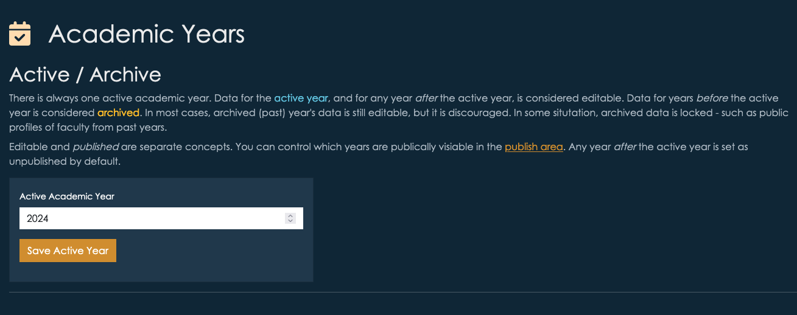
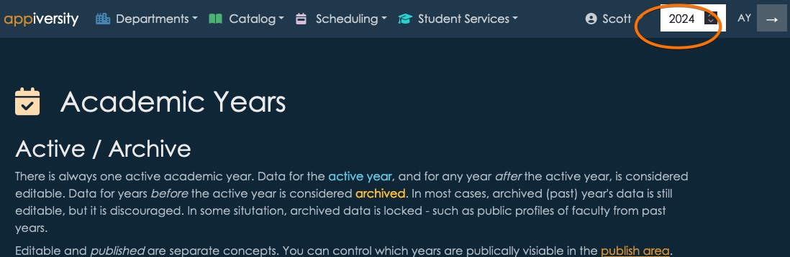
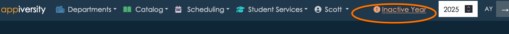
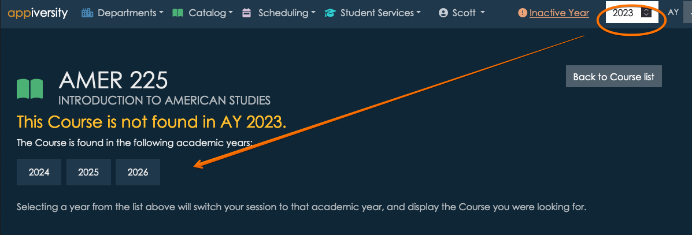
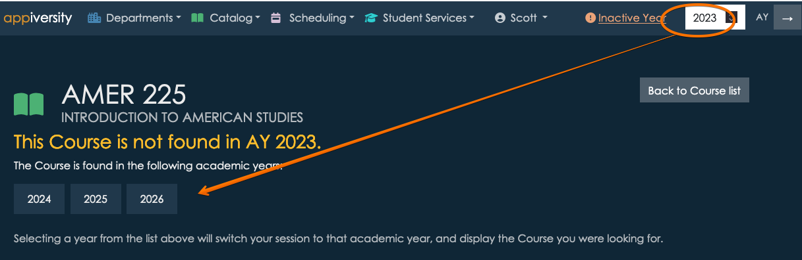

# Active Academic Year
Your account always has an *active academic year*.  This is a global configuration across the entire application, and it is important that you understand how it relates to various features.

## Setting the Active Academic Year
The academic year is accessible from the AY page - which is linked from the home screen.

In order to access the Academic Years page, you need the **rollover** [privilege](../users/privileges.md).  This privilege allows you to change the academic year and rollover data from one year to another.  You should allow a limited set of people to have this privilege, as they can make application-wide changes that can affect *public* facing content as well as internal.  Although most actions are reversible, your institution will want to coordinate the timing of changing academic years and performing rollovers.

Form the academic year page, you can change the current year by entering it into the input box as shown.

This action is completely reversible and non-destructive.  

## Viewing active and other years
Whenever you are using appiversity, you are *implicitly* viewing (and editing) data associated with a *current year*.  It's always clear which year you are working with - it's at the top right of your screen.

At any time, you can change the year you are viewing, by changing the value and clicking the &#8594; button.

It's usually pretty important to know that you are viewing a year that is **not the current AY**.  It's always clear when this is the case, it's shown at the top of the screen.  You can click the text to switch into the current year at any time.

**Important** - When you change the AY you are viewing while you are viewing a page tied to an AY, appiversity will do it's best to help you navigate.  For example, if you are viewing a course in the 2025 catalog, and change the year to 2026, if the course you are viewing exists in the 2026 catalog appiversity will automatically switch you to the 2026 version.  If the course doesn't exist in 2026, you will be shown a list of years the course *does* exist in.  

Below, we are looking at a course in the 2024 catalog.  

When we change the AY to 2023, we see that the course actually isn't present in the 2023 catalog.  We're shown a list of years to choose from instead.  

If the course *had* existed in 2023, we would have been brought directly to that version.

All of this is accomplished through [stemming](./stems.md), and for the most part it "just works" - you won't need to think about it as long as you are using [rollover](./rollover.md) to create each year.

### Exceptions to AY data
There are some exceptions to the rule that everything is tied to academic years.  Anything found in **Settings & defaults** is *global*.  This includes things like label preferences, and application configuration.  The settings in this area aren't date based, and wouldn't make sense to behave one way for one year, and another way for another.

Another exception is **[Users](../users/accounts.md)**.  Users are people who *create, edit, and manage* the data of the institution.  They have full accounts on appiversity, with a set of privileges to control who can change what.  **These accounts are not AY-based**.

**Note** - there's a big difference between **users** and **People**.  **[People](../departments/people-public-people-users.md)** are the people who work at your institution - faculty, staff, etc.  They will use appiversity too - but they use it very differently.  Moreover, *they are data*, too.  Faculty profiles, and the departments they reside in - for example - **is academic data**, and is tied to academic years.  **People** are tied to AY (they are rolled over, and stemmed), **Users** are not.

## Impact of changing AYs
Data for the active year, and for any year after the active year, is considered editable. Data for years before the active year is considered archived. That said, **in most cases**, archived (past) year's data is still editable, but it is discouraged. In some situation, archived data is locked - such as public profiles of faculty from past years. 

Below are some other implications of changing the AY.

### Workflows
Workflows are tied to academic years, like most things in appiversity.  They can be [rolled](./rollover.html) to other academic years, and they are [stemmed](./stems.html).  

Workflows are frequently published via links, and emailed.  It's common for people to bookmark them as well.  It is common for people to attempt to access (initiate) workflows from previous academic years, because the links are unique for each year.  When this happens,  the user will be prevented from submitting the workflow, and will be advised to visit the workflow found in the *current academic year*.  They will also be advised to change the bookmark they are using.

Note, workflows *submitted* in other academic years are always accessible, and can continue to be worked on.  For example, consider the following situation:

- A faculty member submits a travel request in June 2025, which is part of your institution's AY 2025.  The workflow is assigned a tracking ID, and the faculty member is emailed a link to view it's progress.
- The approver (maybe the Dean) is of course away on vacation, and doesn't take a look at the workflow until mid-July 2025.  July 1 is your institution pivot date, and you have changed the current AY to 2026.
- The workflow **is still active**, and the dean can still take action on it.  If approved, all is well.  If revisions are requested, the faculty member can still resubmit the changes.  **The fact that the workflow is from 2025, and the current AY is 2026, is irrelevant**.

The above scenario is **different** than if in July 2025, the faculty member attempts to *start* a workflow that is from AY 2025.  In that case, they are advised that they must instead work with the AY 2026 version of the workflow (if it exists).  If it does not exist, the workflow is unable to be started.