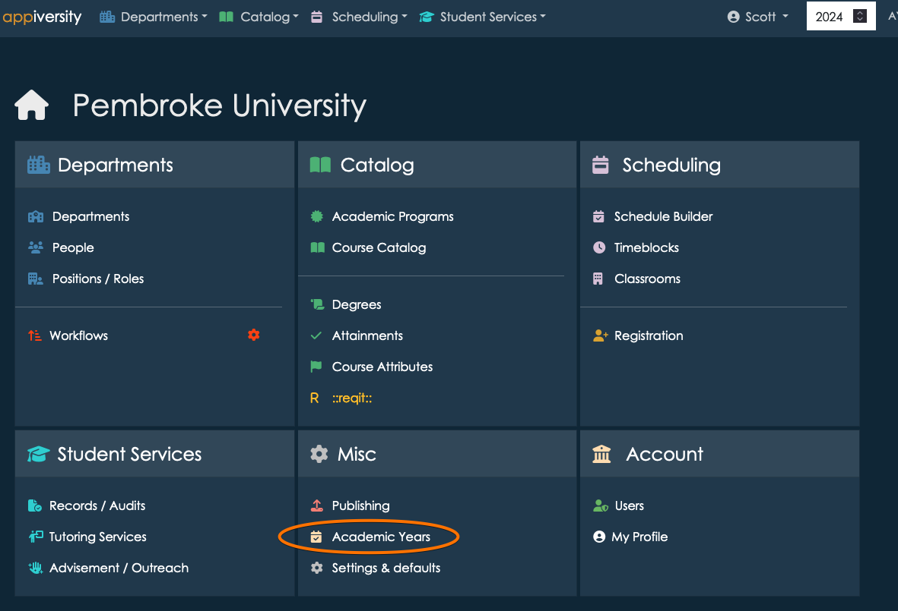
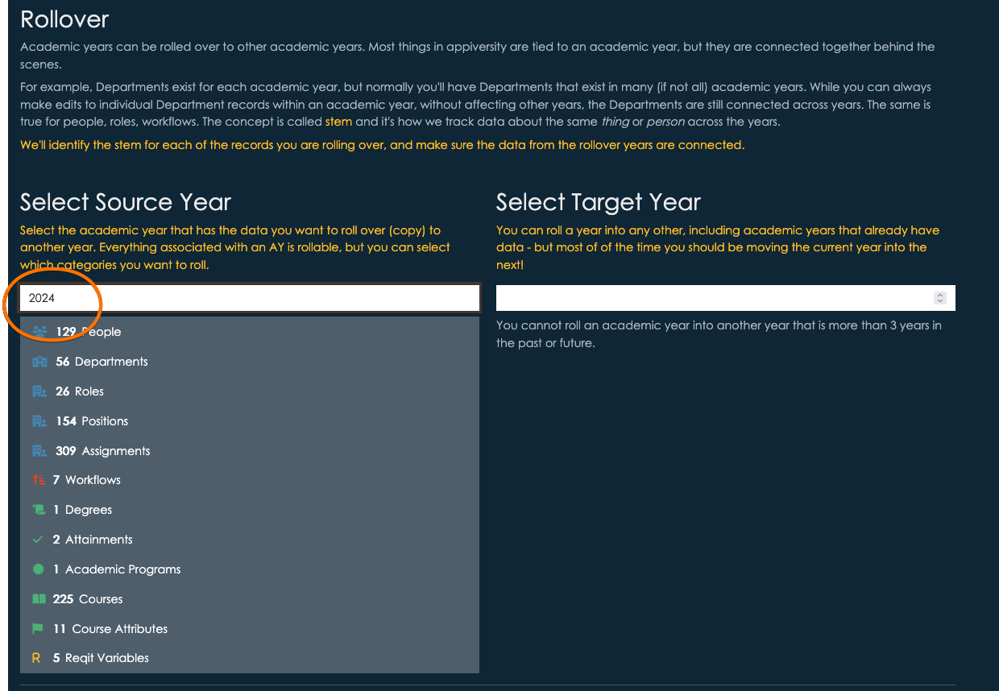
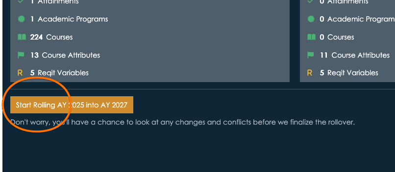
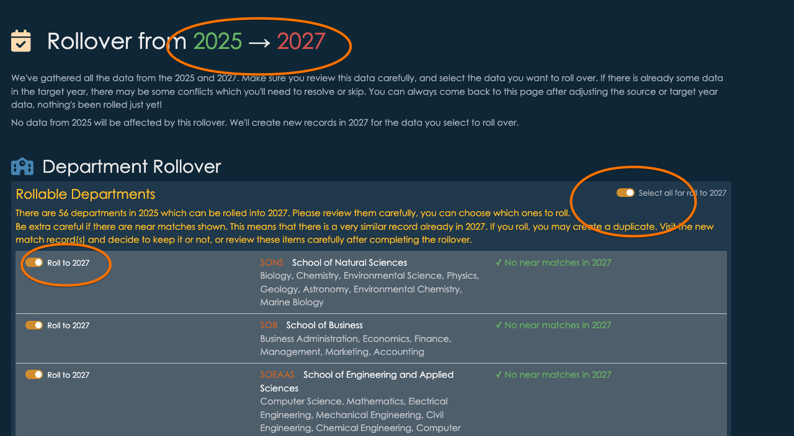
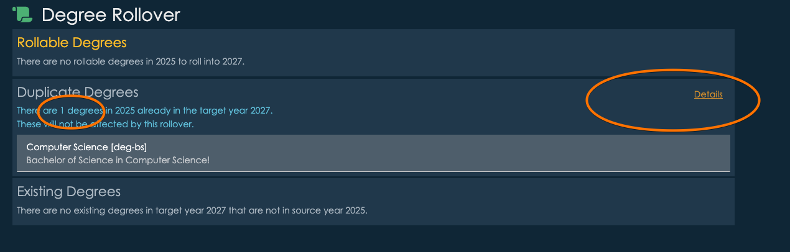
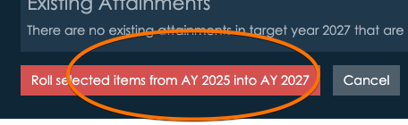
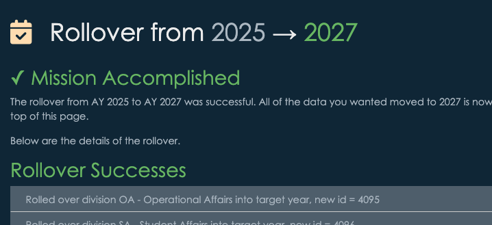

# Rollover
At some point every year, you create a *new* course catalog, for the upcoming academic year.  You don't start from a clean slate, you start with the programs and courses you already have.  You apply changes that have already been agreed upon by various committee, and there's probably a period of time before the catalog *goes live* that more changes can be made.

appiversity calls this transition to a new year a **rollover**, but we don't limit it to course catalog data.  In appiversity, you rollover **everything**.  Having separate version for each academic year for departments, people, roles, positions, courses, timeblocks, classrooms, and everything else makes changes less destructive - reports can still be run on previous years, and you can see how things change.  We make the versioning easy for you to manage through our [./stem](stem) concept, in this section we discuss the **rollover** which *creates* the next version of your institutional data for the upcoming year.

## When to Rollover
First, know that you don't need to pick **one** time.  Think of "rollover" as an import process - you are importing one year's data into another year's data.  You can roll data from one (source) year into multiple (target) years, you can roll data from two source years into on target year.  You can also roll the same source year into a target year multiple times (maybe if you make changes in the source year).  Rollover is *safe* and non-destructive.  You won't accidentally overwrite data.  

For most institutions, it make sense to rollover the *current* [./active-ay](academic year) into the next year at a time when (1) no more changes are happening in the active year, and (2) you start to have a backlog of changes ready to be applied.  For most institutions, this makes sense at different times for different types of data:

1. Departments, people, and positions sometimes change during the academic year.  Things happen, people change roles.  It usually makes sense to rollover *department*, *people*, and *positions* late in the cycle - maybe pretty close to the beginning of the next academic year.  If you rollover this data earlier, you might be put in a situation where changes need to be applied to both the current year, and the next.  It's not hard to do - in fact, in many cases appiversity will ask you if you want to do this when making a change in the current year, and the same department, person, or position already exists in a *future* year.  It's up to you.

2. Catalog data, and other things related to course scheduling tend to be more fixed within a given academic year.  If your institution locks the course catalog once a year, really any time after that would make sense to roll the next year's version - so people can begin actively working on making changes for the next year.  Just like with departments, if you **do** need to make a change to the active year, you can - and appiversity will usually ask you if that change should be applied forward to future years.

****The most important thing to remember**:  To be used most effectively, rollover should be thought of as something you do once or twice a year, when *most* things in the source year are going to go unchanged.  The time you roll data doesn't need to be the same - you may decide to roll catalog data early in the cycle, and roll department data late.  **The rollover is nondestructive**, and you remain in control of what get's rolled and what doesn't - every time!

## How to Rollover
Head over the the academic year page:

If you scroll down, you'll find the area where you can start a rollover.  The first step is to select a **source** year - this is the year you are *taking* the data from.

You'll see a confirmation of what kinds of data you have.  The next step is to pick the **target** year, the year you want the data to be **copied into**.  This might be a completely new academic year, or it can be an existing year.  To avoid error, we limit you to picking a year within a three year window of the *source* year.  Anything more than this probably doesn't make sense.

If you have data already in the target year, it will be listed.  Here's a hypothetical example of moving 2025 data into 2027, which has a few data items already in it.

At this stem, you aren't moving any data - so it's perfectly safe to choose a *target* year that already has data.  In the next step, you'll be able to review the data and decide exactly what to move, and what to skip.

After clicking the start button, you'll be taken to a (potentially) long screen, detailing **every item** that can be rolled.  This page shows you clearly which years you are rolling, and it breaks the items up into categories.  The categories, and their orders, are driven by their dependencies.  For example, if you are importing an assignment, the person, role, and department need to be imported too.

For each category, you can select or unselect the **entire** group, or you can select/unselect individual items.  By default, all items that we are do **not** see in the target year will be selected for rollover.  If we **do find duplicates**, we will prevent you from rolling that data.  You will not accidentally overwrite data if it was detected as a duplicate!

For the most part, the defaults tend to be the right choices.  When duplicates are found, you can see their details.  You can always delete the data in the target year, and then restart the rollover if you really want to include the duplicate in the roll.

There may be thousands of records.  It's worth reviewing things until you are comfortable that the roll looks like it's what you want.  Once you do the rollover, the data that lands in the target year is there for good - or at least until you delete it manually!

When you are ready, click "Roll selected items" at the bottom of the screen.

If there are minor errors, for example, if you've tried to roll an assignment (the record that indicates someone is working within a certain role, within a department), but you didn't roll the actual person, then errors will be reported on the next screen - but the rest of the items will be rolled successfully.  In the unlikely event there was a larger issue with the data you were rolling, we'll let you know what happened, and we'll *rollback* the entire change so you can try again.

Go ahead and change your current year to the new AY that you created to check out the new data. 