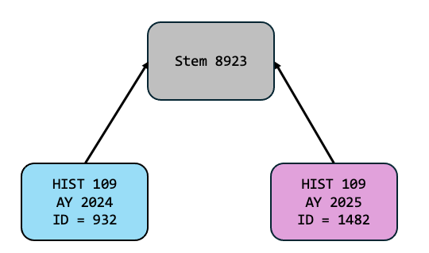

# Navigating Across Academic Years w/ Stems
The data you hold about your academics is *versioned*.  The most obvious example of this is a **course catalog**.  The list of courses available changes from year to year.  It's more than just courses - the requirements of programs change.  Most academic institutions handle this by using a concept of a **catalog year** - and they understand it's critical to keep the old versions!  Students who enter an institution in 2025, for example, are bound to the academic requirements that were in place in 2025 - not necessarily new ones that take effect later on.

We take this concept further, extending it to almost **all** data.  Department names change over the years.  Department structures undergo reorganizations, and the relationships between them change.  The people, positions, and assignments within departments change over time.  Workflows change too - and so do details like course attributes, timeblocks for scheduling, classrooms.  Within appiversity, **all of these things are versioned** by **Academic Year**.  The same course, department, person, or scheduling time block might exist in many different academic years, but they are **distinct** - a change in one year won't necessarily effect another.

##  Stems
The concept of *versioning* is pretty straightforward.  It's cumbersome though - when looking at a course from 2024, it's often hard to understand how you can see that same course from 2022 - at least in most enterprise solutions we've seen.  This is where appiversity's **stem** concept helps.

Unless you are starting from scratch, most of "this year's" data is going to start from last year's data.  We help you [rollover](./rollover.md) content from year to year, making this process pretty painless.  During the rollover, we make **copies** of all the rolled data, updating the **academic year** it is associated with.  Those copies however share one link - a **stem** - which is just a unique integer ID we assign the data.

For example:  Imagine a **new** course titled HIST 109 - Introduction to Modern American History was created for academic year 2024, and given an ID of `932`.  That ID number is visible in the URL for the course page, but there's another ID also created - the stem.  Let's say the stem is `8923`. 

In 2025, when your roll your courses over, HIST 109 - Introduction to Modern American History is copied - and the 2025 version gets a new ID - let's just say its `1482`.  The stem value will be the same, we copy it during roll - `8923`. 

The great thing about this link is that if you make a change to the 2025 version of the course, we won't loose the connection between them.  Even if it's a course number change - you always have the link via the stem to see previous versions of the course.

## Navigation
**Most** of the time, you won't even think about stems - they just work.  If you are viewing a course for 2024 and you change your catalog year to 2023, appiversity will use the stem of the course you are viewing to automatically bring you the 2023 version of the course.

Sometimes, when you are accessing something that is versioned and you change the current academic year, the target academic year won't have a version.  For example, the HIST 109 class that was created in 2024 wont' be found if you change your catalog year to 2023.  In this case, appiversity will use the stem to show you all the years that course is present in, and give you the choice to either switch your academic year, or to stay within the year and view the larger course listings.  

The same technique is used when viewing people, departments, roles, positions, degrees, workflows, timeblocks, classrooms, etc.  In most cases, you can effortlessly navigate between academic years without losing place.

## Stem Detection During Rollover
During the rollover process we take a lot of care to preserve stems.  Sometimes, you might be rolling data from one year into another, where the **target** year already contains data.  We will check to see if data in the source year and target year have the same stem values, and skip rolling over that item.  We will also check to see if the target data has something that "looks the same" - meaning, maybe you already created a course with the same subject and number in the target year, but it's in the source year of your rollover too.  In these cases, appiversity will offer you the choice to merge the records so they share the same stem, or leave them distinct.

In most cases, if you are using [rollover](./rollover.md) like we recommend (first, before starting to make changes on the target year!), you won't run into any merges at all.