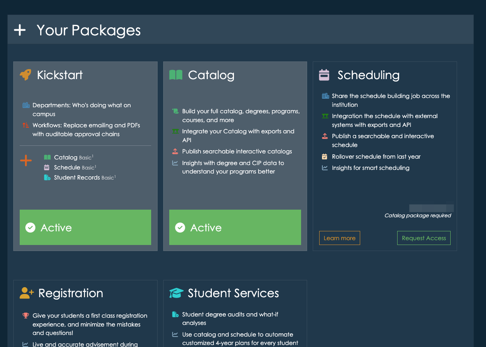

# Account Upgrade

Users can access the Account Upgrade page by navigating to their **Account page** from the dashboard. Please note that only users with **Account** or **Representative of Record** privileges will have access to this page.

## Viewing Your Current Packages
On this page, you will see a list of packages your account currently has access to. This allows you to review your current plan and explore available upgrades.

## Requesting an Upgrade
If you would like to upgrade your account by adding new packages—such as **Catalog**—you can submit a request directly from this page. Once we receive your request, we will contact your institution’s **Representative of Record** to confirm the upgrade and begin the process.

## Processing Time
After receiving confirmation from your institution’s Representative of Record, we will start adding the requested package right away. Most upgrades are completed within **1-2 business days**.

For any questions regarding upgrades, please contact us at [support@appiversity.com](mailto:support@appiversity.com).

