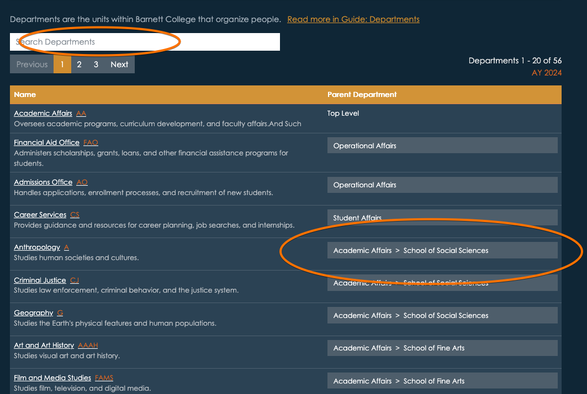

# Department
Departments are the organizational units of your institution.  

Departments can be academic departments, administrative units, or any other grouping of people. At a minimum, all academic units should be represented if you plan to use Catalog and other appiversity features. We recommend you organize academic Departments under a single parent, such as "Academic Affairs" so you can later add different non-academic organizations to fill out your organizational chart.

Remember: Academic Departments are not the same as Academic Programs , like a major, minor, or graduate program. Academic Departments can be connected to multiple academic programs.

## Listings
Departments can be created, edited, and searched.

Organizational structure is front and center, you can always see where each department falls within the organization, and access org-charts from any department page.

Note, while only appiversity users, faculty, and staff can log in and view the pages for Departments through the interface in these screenshots, the same data is available to the *public* if you choose to [publish](../publishing/) department listings.  For departments, the department data can be embedded into any website you choose - which includes navigational links to parent and child departments, along with listings of the people who work within the departments.