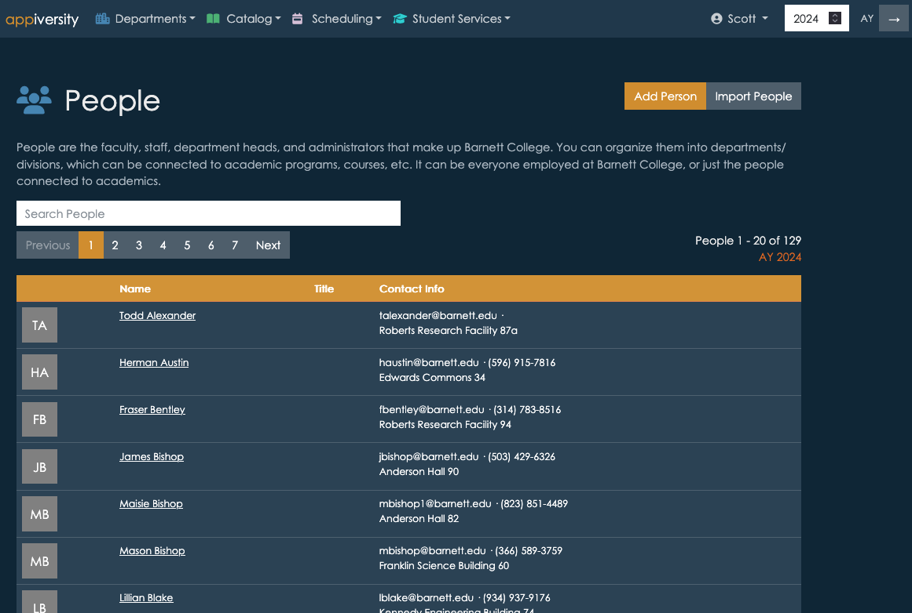
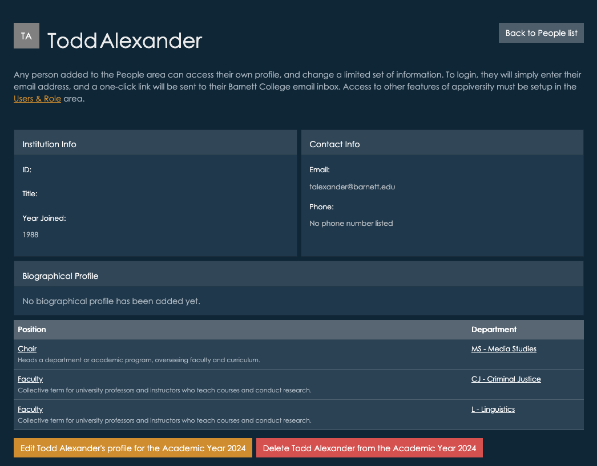

# People
People listings are searchable by name and email address.  For users with the People [privilege](../users/privileges.md), new People records can be added or [imported](../publishing/importing.md).  

When viewing a given person's profile, their positions within your institution will be listed, along with other biographical info.

Note, while only appiversity users, faculty, and staff can log in and view profiles for People through the interface in these screenshots, the same data is available to the *public* if you choose to [publish](../publishing/) department listings.  For people, their profile data can be embedded into any website you choose.  Since everyone listed in People can also login to appiversity and update *their own* profile, this is a great way for your institution to distribute the workload when keeping everyone's information up to date.

## People Avatars (logos)
By default, we will use the person's email address to look up whether they have defined an image to accompany their name with [https://gravatar.com/](https://gravatar.com/).  While many people have already created an account with [gravitar](https://gravatar.com/) (often by way of other third parties), some haven't - and you (or the person themselves) can always upload an image to use.  