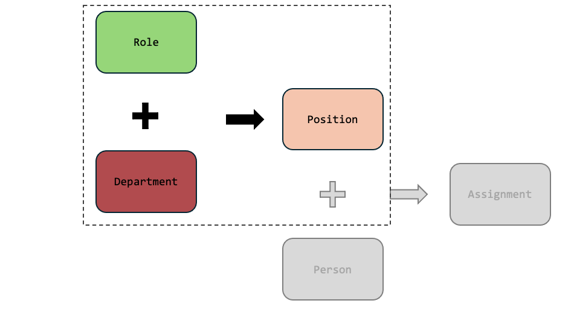
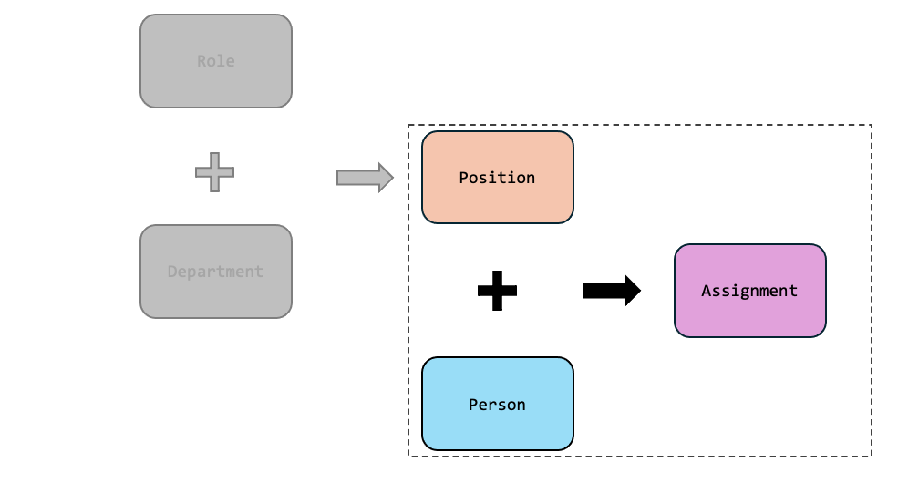
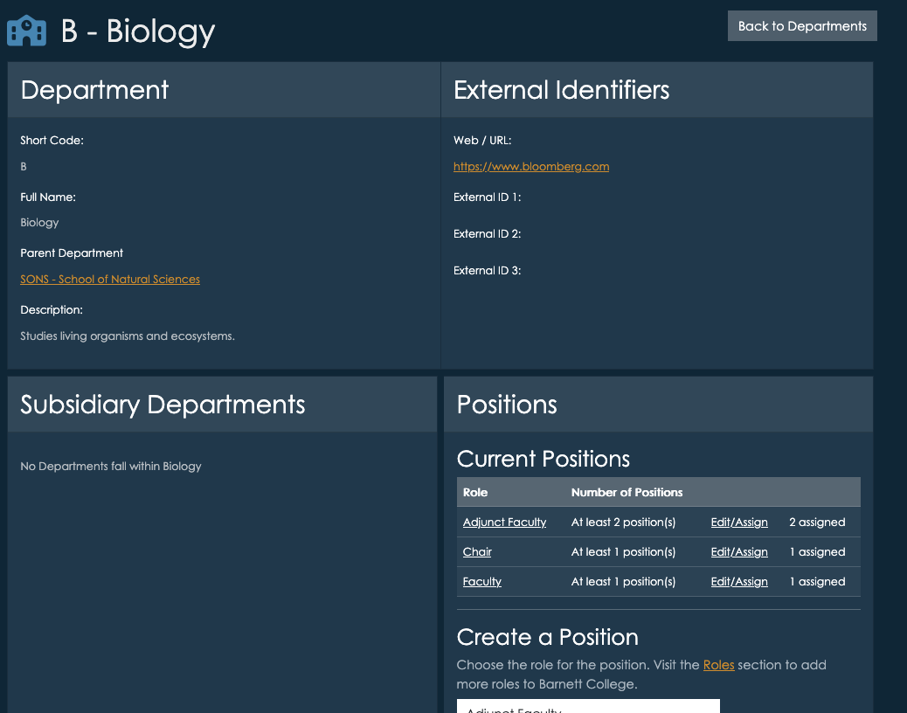
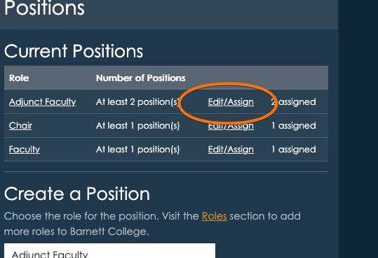
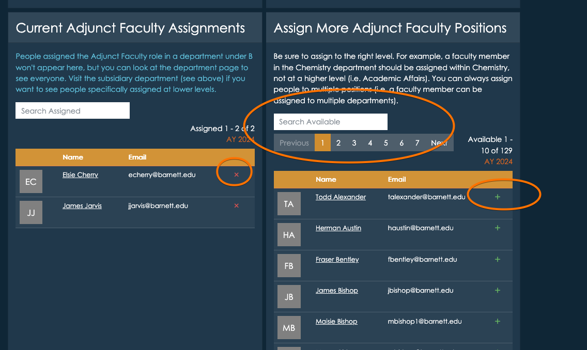

# Roles, Positions, and Assignments
Roles are defined at the top level of your institution. A role might be "Dean", "Department Chair", "Faculty" "Staff" or "Student Worker" and you can create as many roles as you need. Roles are used to create positions within Departments, but the actual roles are defined at the top level - so try to use generic terms that can be used across as many divisions as possible. This lets Insights do it's best work - so it can integrate data about roles across many Departments.

Roles are just labels, Positions are actually filled by People and connected to Departments. For example, the role Dean would be used to create a Position in each of the academic Departments that have a dean. The Position would then be filled by creating an Assignment for a specific person. This is how the we track who is in what role, and when. Positions can have additional attributes, like interim.

When you define positions within a department, you will be able to specify how many positions there are. For example, a department might have many faculty positions, but only one dean.

You can also create roles for committees, for example "Academic Review Committee Representative". If representatives are selected from each academic department, you can then create a position for each department, and then fill the position with a specific person. You can also create a department for "Academic Review Committee" and defined a Role for "Chair" and several "Member" positions - and organize the committee this way. The choice is yours! 

## Creating Roles
The Roles listings are accessible from the dashboard, and main menu under departments.  Roles are simple, but choose them carefully.  The label and description you use should be as generic as they can be, so they can be used across many departments.  The more reuse you get out a Role, the better reporting and aggregation you get!  You can always refine the description of a role when creating a *position* within a specific department.  

## Creating Positions
Positions are part of a department, and so you create positions from within a department page.  For example, if we were looking at positions within a Biology department, we might see positions for faculty, adjunct faculty, and a department chair.  These are Roles, but now they have been associated with a specific department.

You can create any number of positions within a department, using roles you defined in the Roles listings.  Each position can have a "multiplicity" - meaning you can say there is always "exactly 1" chair, or there are "up to 10 adjunct faculty".

### Choosing the right level
Always create positions at the right level. For example, if the department is a school/unit, containing several academic department, and you have a role called "Department Chair", it shouldn't be added to the parent school/unit, it should be added to the actual academic department where the chair sits. All "Department Chairs" in departments under the parent will still be listed - but this way the department chair will be specifically attached to the department that the person is actually chairing.

For instance, if there is a School of Science, and within it sits a Chemistry department, the Department Chair for Chemistry should be listed as a position in the Chemistry department.

## Creating Assignments
Assignments are the most important step - they stich the position together with a person, connecting everything.  From the position portion of the department page, click "Edit/Assign".

This brings you to the position details page, and towards the bottom you can select people from your [People listings](./people.md) to fill those positions.

