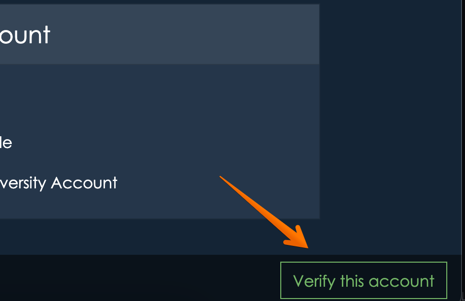

# Verification
When you sign up for appiversity, you'll have access to all of the features on the **Kickstart** plan level.  This includes the full set of [Department](../departments/index.md) features, full access to [Workflows](../workflow/index.md), and the basic features of [Catalog](../catalog/index.md), Scheduler, and Records.   

Some of those features let you *publish* listings to the web - whether it's faculty listings and profiles, public-facing workflows, or department contact information.  

We've created a streamlined onboarding process for you, signing up is quick and easy.  The only problem with that is that we don't want someone to claim your institution on appiversity and publish inaccurate data by creating an account.  For example, a student with your institution's domain in their email address might try to create an account!

That's where **verification** comes in.  While an account is **unverified**, we don't let that account publish any data in a way that it is accessible to the general public.  That's a big limitation, but it's necessary to protect your institution.

## Account verification is FREE
We just need contact info for someone authorized to represent your institution. The process is simple, and it helps make sure your institution is represented accurately.  You can get verified at any time, but until your account is verified, you won't be able to publish content or have more than a few users.

If your account is unverified, **all** users will have a "Verify this account" button at the bottom of their screen.

Clicking on this button will bring you to a form, which lets you start the verification process.

## How do we verify your account?
We'll ask for contact information of someone we can verify can speak for your institution.  This can be someone in an academic leadership position - like a Vice Provost, Provost, President, or Chancellor.  It can be a C-level executive, like a CIO/CTO, or the leader of a core academic unit, like the Registrar.  
          
We want to verify that this person's contact information is valid, and so we need a web address of a page that lists this person's contact information on your institution's website.  This can be a directory page, a contact page, or a page that lists the institution's leadership.  
       
We can also use generic email addresses (provost@collge.edu, for example), as long as that email address is listed on the public web address you provide.
        
We will reach out to the contact you've provided.  Once we've been able to verify that your account with us is indeed on behalf of your institution (it's as simple as a quick email reply usually!), we'll remove the verification prompt on your account and you'll be able to start taking advantage of the **Kickstart** plan full.

## What happens if someone creates an "unauthorized" account?
It's possible an employee, alumni, or even a student can create an account with us.  All they need is a valid email address under your email domain.  **That might sounds a little scary**, but it's not as bad as it sounds.

An unverified account can create department listings, faculty listings, workflows, and build catalog data - but that data can't be access by anyone without logging into appiversity, under the very same insitutional account.

**Unverified accounts** have a strict (and low) limit of users.  Combined with the inability to publish anything, an unverified account is really just a *private* sandbox.

When you sign up for an account, if someone from the same email domain (your institution) has already created an **unverified** account, you'll be notified - but you will be able to create *your own* **unverified account** too.

Once an account for an institution **is verified**, then no additonal accounts can be created.  In addition, any additonal **unverified** accounts under the same insitution are disabled.

All told, the verification process protects your institution, and also allows you to get started quickly.  Don't hesitate to verify, it's quick and painless!