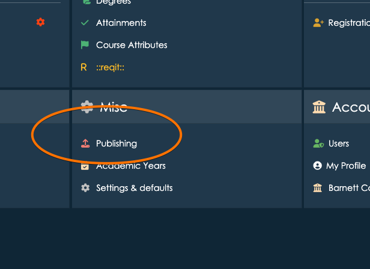
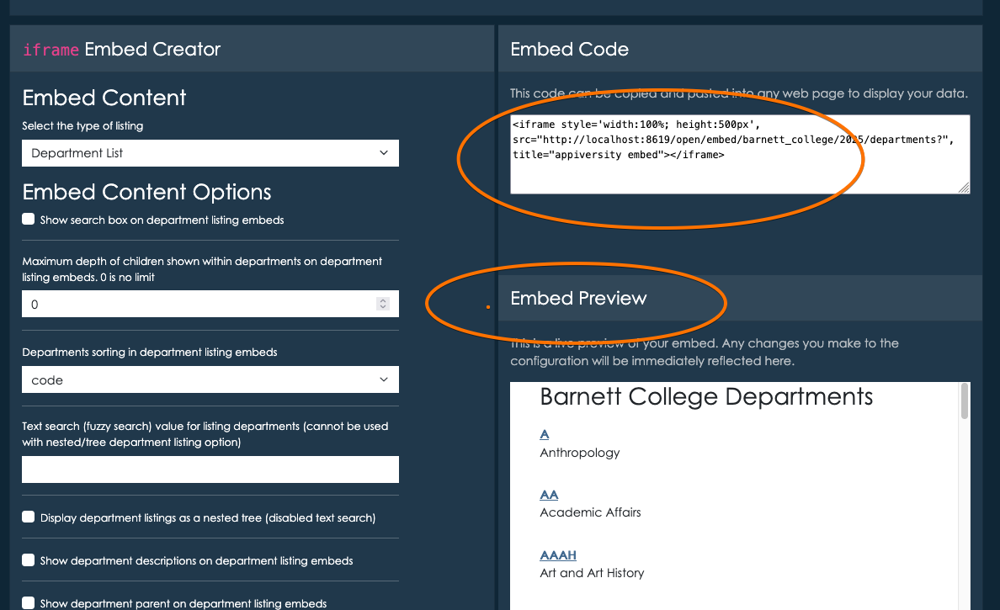

# Embedding with iframes

**appiversity** provides a powerful way to share and display your institution’s data on your public website. With the ability to configure how data listings—such as course listings, program listings, departments, people, and workflows—are exposed to the public, **appiversity** makes it easy for you to showcase key information while maintaining control over what is made publicly accessible.

### Embedding Listings on Your Institution’s Website

One of the key features **appiversity** offers is the ability to create snippets that can be embedded into your institution's website. These snippets allow you to display live data—such as courses, programs, departments, or workflows—directly on your site, making it easy for prospective students, faculty, and the public to access important information.

We accomplish this through **iframes**, a widely-used HTML element that allows you to embed another document within the current page. Using **iframes**, you can display appiversity data directly on your website, without requiring your web pages to be modified every time the data is updated. When the data within **appiversity** is changed or updated, the embedded iframe automatically reflects these changes on your institution’s site.

### Setting up Publishing
From the dashboard, you can access Publishing - which is where all of the publication settings are controlled.

Here you can change global preferences that effect all public-facing data.  This includes display preferences - like fonts and colors, along with labels (for example, if your institution calls academic departments "units", you can specify that here).  This page also includes configuration of where you will end up publishing listings.  These settings help you integrate appiversity with your own institution's web site.

The `iframe` Embed creator area allows you to interactively build `iframe` components containing department, people, position, workflow, and catalog listings.  These components can be configured to include search boxes (to allow people viewing the content to search listings), filters (to include only partial listings), and display property specifications (which properties about which records you show to public users).  All the configuration is done interactively, and you can take the `iframe` code snippet at add it anywhere on your institution's web page to embed *live* appiversity data.

### Working with Iframes

An **iframe** (inline frame) is an HTML element used to embed one HTML document within another. For example, instead of linking to a separate page or document, an iframe lets you display the external content directly within your web page. In the context of **appiversity**, we use iframes to embed live data listings like course catalogs or departmental listings.

#### Benefits of Using Iframes:
- **Easy embedding**: Iframes allow you to quickly add data to your website without needing to redesign or overhaul your site’s structure.
- **Live updates**: When you update data in **appiversity**, the iframe automatically reflects those changes on your site, ensuring your listings are always up-to-date.
- **Separation of concerns**: Iframes provide a way to separate the presentation of external data from the core content of your web page, making it easier to manage.

#### Technical Considerations:
While iframes are generally easy to use, there are a few technical considerations you and your IT team will need to be aware of to ensure everything works smoothly:

1. **Cross-Domain Issues**: Iframes often encounter restrictions when embedding content from a different domain (cross-origin requests). To overcome this, we will work with your IT team to ensure the necessary **CORS (Cross-Origin Resource Sharing)** headers are configured on your web server, allowing the iframe content to be displayed properly.
   
2. **Responsive Design**: If your website is responsive (i.e., it adjusts based on the device’s screen size), you may need to adjust the iframe’s dimensions or use responsive iframe embedding techniques to ensure it looks good on all devices (desktops, tablets, mobile phones). Our team can help with this setup to make sure the embedded data appears correctly across various screen sizes.

3. **Security Considerations**: Iframes introduce some security concerns, particularly with embedding third-party content. We will ensure that the iframe content served from **appiversity** is secure and follows best practices, such as using HTTPS, to avoid issues related to mixed content warnings in modern browsers.

4. **SEO and Accessibility**: Since iframes are embedded content, they don’t contribute directly to your website's SEO ranking. However, with proper usage, you can ensure that embedded data is still accessible to search engines and users. If necessary, we can work with your web development team to optimize iframe content for accessibility and search engine indexing.

#### Collaborating with Your IT Team

We understand that integrating iframes into your website may require some coordination with your IT department. Our team is available to support you through the process, ensuring the embedding process works smoothly with your institution’s web architecture. From configuring CORS headers to troubleshooting potential conflicts, we’re here to help your IT team make the necessary adjustments for a successful iframe implementation.

### Conclusion

With **appiversity**, you can easily configure how your institution’s data is exposed to the public, allowing you to share dynamic, up-to-date information via embedded iframes. This integration enables seamless sharing of course listings, programs, departments, and workflows on your institution’s website, with minimal effort required to keep everything current. If you need assistance with the technical setup, our team will work closely with your IT department to ensure smooth integration and address any technical challenges.