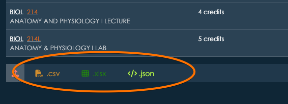

# Exporting Data: CSV, JSON, and Excel Formats

appiversity allows you to easily export various types of data, such as courses, degrees, programs, attributes, people, departments, roles, and workflows. On any listing page, you'll see export buttons at the bottom of the list, which give you the option to export data in three formats: **CSV**, **JSON**, and **Excel**.

### What Are CSV, JSON, and Excel Formats?

1. **CSV (Comma-Separated Values)**
   - **Definition**: CSV is a plain text format where each row of data is represented by a line, and the fields within each row are separated by commas. It is a simple format that works well for tabular data.
   - **Use**: CSV is useful when you want to quickly view or analyze data in a basic table format. It can be easily imported into spreadsheet tools (e.g., Microsoft Excel or Google Sheets) or used by databases for quick processing.

2. **JSON (JavaScript Object Notation)**
   - **Definition**: JSON is a text-based format that stores data as key-value pairs. It is more flexible than CSV, supporting hierarchical or nested structures, which makes it ideal for more complex data.
   - **Use**: JSON is appropriate when you need to export more detailed or structured data that includes relationships or nested information. It is widely used for data interchange between systems and is easy to work with for developers.

3. **Excel (XLSX)**
   - **Definition**: Excel is a spreadsheet format that supports more advanced features than CSV, such as data formatting, formulas, charts, and more. It is commonly used for data analysis and presentation.
   - **Use**: Excel is helpful when you need to work with data in a more structured, visual, or analytical way. It provides a rich interface for managing and manipulating large datasets and can be used for creating reports or performing calculations directly in the file.

### Full Export with JSON

Among the three formats, **JSON** offers the most complete export of your data. It captures a wider range of attributes and supports complex data structures, including nested or related data that can't be represented in a simple table like CSV. If you need the most detailed export, JSON will provide a fuller picture of the data, including all the attributes associated with the records.

### Export Access

The ability to export data depends on the type of account you have:

- **Kickstart Account**: With a Kickstart account, you can export data related to departments, people, and roles. These exports cover core organizational data but do not include full catalog data.
  
- **Catalog Package**: If you need to export catalog-related data, such as courses, degrees, programs, or attributes, you must have access to the **Catalog Package**. This package enables full access to the catalog data and all associated exports.

### Integration with External Systems

When exporting data for integration with other systems, the format you choose depends on the nature of the integration:

1. **JSON for Integrations You Control**
   - **Best for**: If you're integrating with an application or system where you have control over the implementation (such as a custom backend or internal tool), **JSON** is the preferred format. Its structured nature makes it easy for developers to parse and use the data in a programmatic way. JSON can handle complex, hierarchical relationships, making it a powerful choice for integration when you need to transfer detailed data.
   - **Example**: If you're pushing data from our system into an API that your team has developed, JSON allows you to map the data easily, ensuring it matches the structure required by the receiving system.

2. **CSV for Third-Party Applications**
   - **Best for**: For many third-party applications, particularly those that don't have a custom integration setup, **CSV** is the most widely supported format. Most systems, from data analysis tools to CRM software, are designed to work seamlessly with CSV files, allowing for easy import and export. 
   - **Example**: If you're sending data from our system to a tool like Google Analytics or a marketing automation platform, CSV is often the easiest format for these platforms to process without requiring additional configuration.

3. **Excel for Sharing with People**
   - **Best for**: When you need to send data to people outside your organization or to others who don’t have direct access to the platform (such as stakeholders, collaborators, or departments), **Excel** is often the best format. It allows you to include additional formatting, provide data insights with built-in charts, and even make use of formulas for quick calculations. Excel is also more user-friendly for non-technical users.
   - **Example**: If you're sharing a list of courses or departmental data with someone who needs to view the information and maybe make edits or calculations, Excel provides an intuitive, familiar format.

### Summary

The ability to export data in **CSV**, **JSON**, and **Excel** formats offers flexibility depending on your needs. Whether you're working on internal integrations with your own applications, exporting data to third-party systems, or sharing information with others, the system provides the necessary tools to ensure smooth data exchange. JSON is ideal for structured integrations, CSV is best for broad compatibility, and Excel works well for collaborating and sharing data with those outside the system.