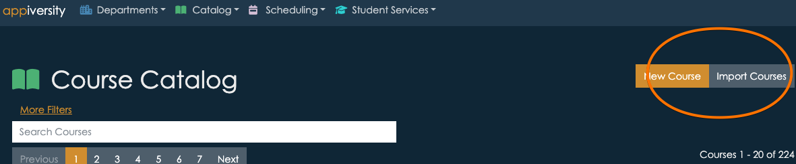
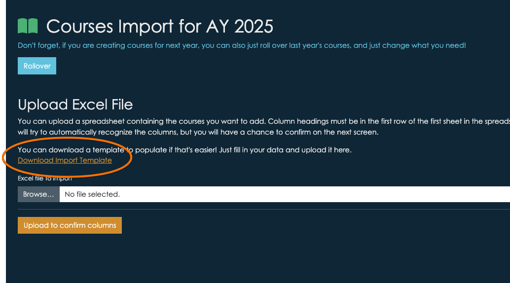
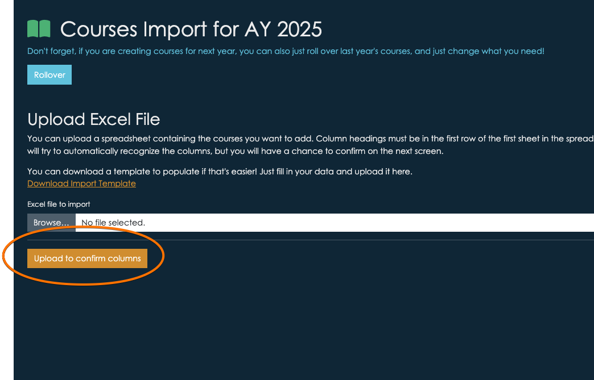
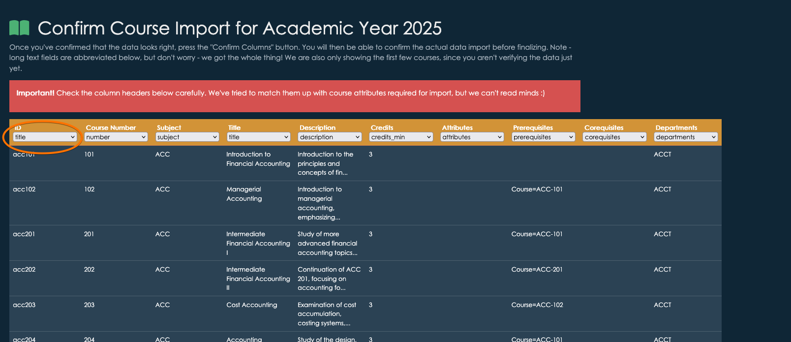

# Importing data
appiversity makes it easy to import large amounts of data quickly and efficiently. You can import **Departments, People, Degrees, Programs, and Courses** using our preformatted **Excel templates**. Our system intelligently detects the type of data you are importing and ensures accuracy before finalizing the process.

## **Step 1: Download the Excel Template**  
Whenever you are on a listing page that supports imports, you'll see a button to import items

You can click that button and you'll get to a page that contains the template

## **Step 2: Populate the Spreadsheet**  
Once you download the template, follow the instructions within it. We've named some commonly used columns.  You can change them, or use your own spreadsheet if you already have your data.  If you use your own column headers, just keep in mind that we only import data fields appiversity supports.  It's perfectly fine to have extra columns in your spreadsheet - but we won't import anything we can't use.

## **Step 3: Upload and Verify Data**  
Return to the **Import Data** page, and upload your file.

We'll do our best to detect how each column in your spreadsheet should be used.  You'll be able to preview column usage and change what we've recommended too.

Just access the drop downs in each column header to change the way we should import your data.  You can also just choose -omit- if the column doesn't match anything we support.

Once you confirm the columns, you'll see a **complete** preview of all the data you are about to import.  If there's any problem with a record, we'll indicate it, and it will be omitted from the import.  You can always import the rare issues manually - we like to be as careful and safe as possible with anything done in bulk.

Once you've reviewed, click the "Import" button at the bottom of the screen!

## **What’s Next?**  
We are continuously improving our data integration capabilities. Stay tuned for **API access**, which will provide even more flexibility in managing your institutional data.

For assistance or questions, please contact [support@appiversity.com](mailto:support@appiversity.com).

