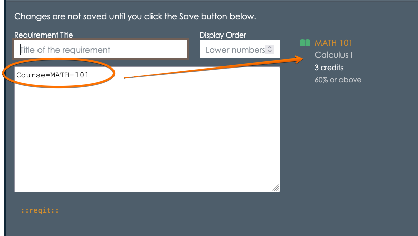
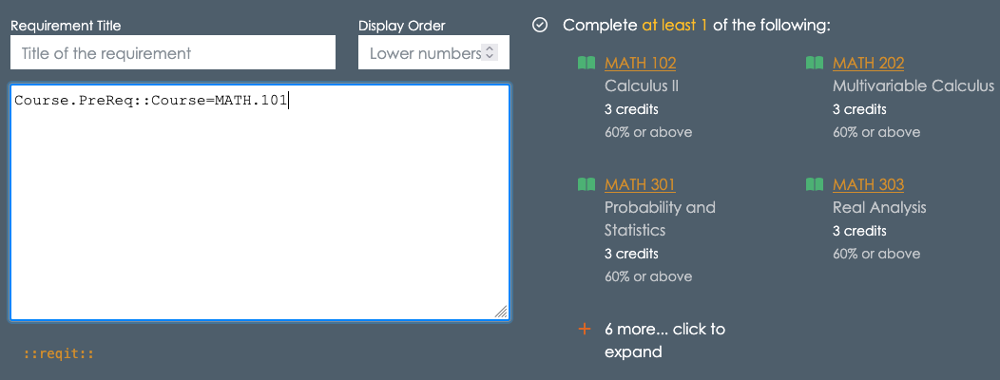
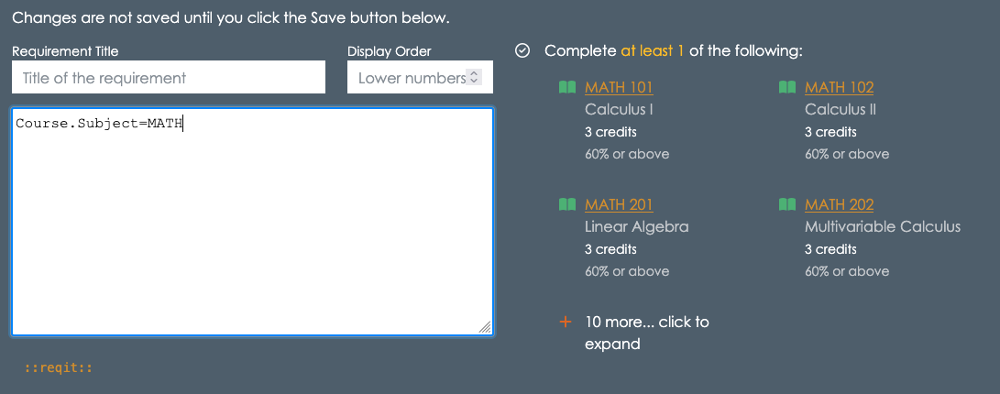
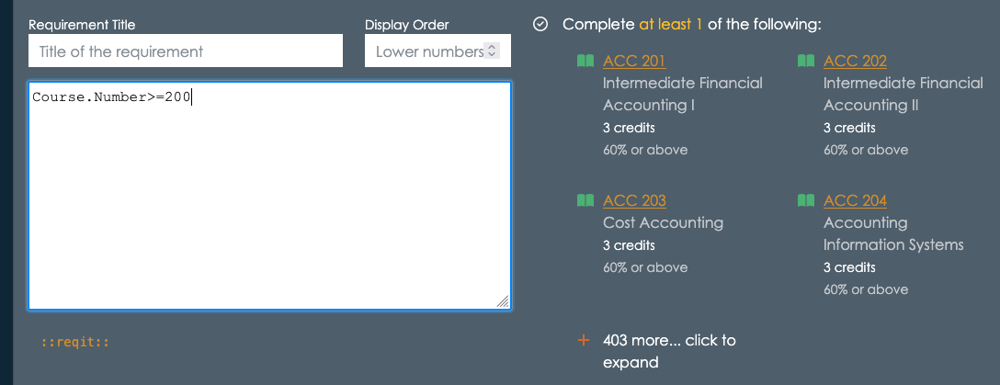
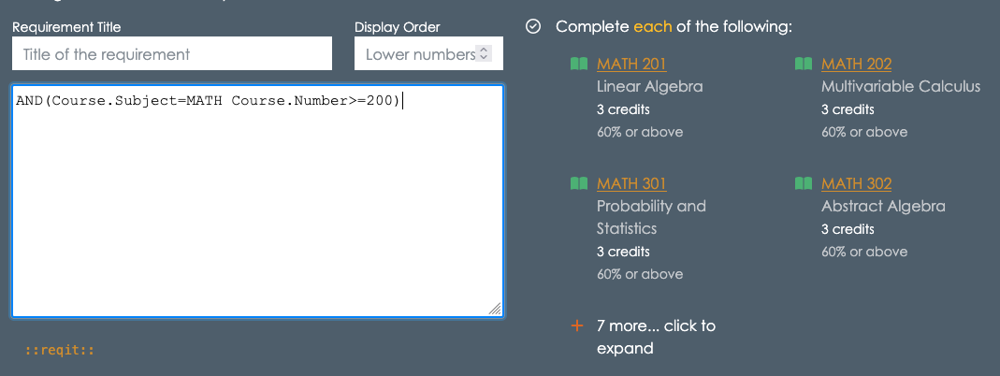
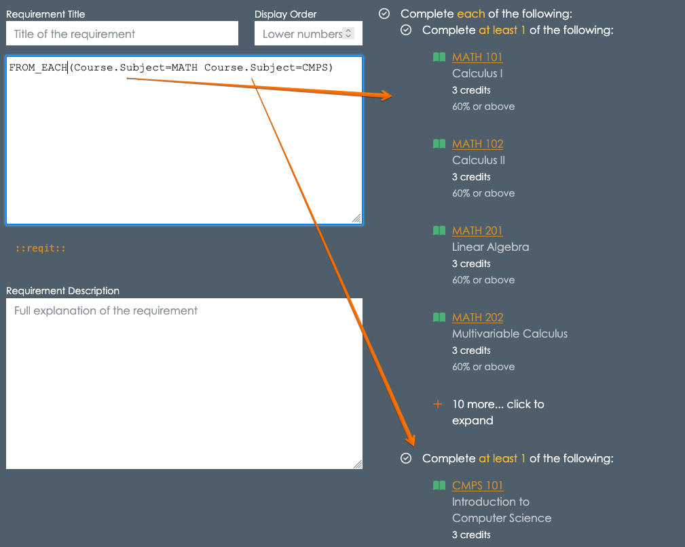

# Introduction to Reqit
Reqit is a simple way to describe course and program requirements in the appiversity Catalog. This guide will help you understand how to use Reqit to express prerequisites and other conditions in an easy-to-follow format.

Reqit statements describe what courses or programs a student needs to take before enrolling in another course or completing a program. These statements use simple rules and keywords to express conditions.

Let's start with an example:  Suppose a course requires that a student completes MATH 101 - Calculus 1 before registering.  Within the course's requirements editor, you would be able to input this requirements using the *course* Reqit syntax:  `Course=MATH-101`.  



The `Course=MATH-101` is an example of a *course match* syntax, and Reqit supports Course matching, program matching, and attainment matchers

## Course Matchers
The text `Course=MATH-101` *resolves* to a specific course- MATH 101 Calculus 1.  The syntax can also be written with a dot notation as `Course=MATH.101`.

Its important to remember that there should be *no spaces* between the `Course`, `=`, and `Subject.Number` tokens.

### Specifying sets of courses
You are not limited to specifying a specific course.   The course syntax supports selecting courses based on specific attributes as well.

#### By Subject
You can select *all* MATH courses using `Course.Subject=MATH`, which resolves to all the courses with subject of MATH.

#### By Number
You can select courses with specific numbers, and use `=`, `>`, `<`, `>=`, `<=`, `!=` to refine your selection.  For example, `Course.Number=101` *resolves* to all courses in the catalog that have a course number of `101`.  Likewise `Course.Number>=400` resolves to all courses with a number 400 or above.

#### By Credit
You can specifically select courses with a certain number of credits.  For example, finding all 4-credit courses is done with `Course.Credits=4`.  You can use `=`, `>`, `<`, `>=`, `<=`, `!=` to refine your selection.

#### By Grade
You can specify a course as being a requirement that can be met *only* if a specific grade was reached.  By default, specifying a course as a requirement means the student must **pass** the course - which we default to a minimum grade of 60.00.  You can change this - for example if a student needs to have taken Calculus 1 and achieved a 80% or better, then you can write `Course=MATH.101(mg=80)

#### By Attribute
Select courses by attributes using the `Course.Attribute` syntax. This syntax can specify courses with attributes using the `=` or `!=` operators.  For example, `Course.Attribute=GE` resolves to all courses that have the GE (General Education) attribute.

#### By Prerequisite/Corequisite
One of the hardest requirements to model is often when a course requires a student complete a course that requires something else.  An example, perhaps you want to say that in order to take MATH 400, the student must have completed a course that requires MATH 101 as a prerequisite.  This is a large set of courses, and the courses may have different subjects, and certainly can be at different number ranges.  With Reqit, you can specify this requirement directly using `Course.PreReq::Course=MATH.101`.  That expression finds every course that lists MATH 101 as one of it's prerequisites.  `Course.CoReq::` does the same thing for corequisites.



## Combining selections with `AND` and `OR`
You can build arbitrarily complex sets of course requirements by combining all of the selection operators above with `AND` and `OR`.

Again, by example:  Suppose we want to select courses that have a subject of MATH and course number *greater or equal to 200*.

- `Course.Subject=MATH` resolves to all MATH courses (any number)



- `Course.Number>=100` resolves to all courses with number >= 200 (any subject)



- `AND(Course.Subject=MATH Course.Number>=100)` resolves to courses with subject of MATH and course number >= 200.





Reqit always resolves to a *set* of requirements (in this case, courses).  The operators can be used in a nested fashion to create more detailed requirement lists.

As a final example of using just `AND` and `OR`, the following Reqit will resolve to "Either CMPS 450, or any 3 credit or greater MATH or STAT courses with a course number greater than 200":

```
OR(
  Course=CMPS.450 
  AND(
    Course.Credits>=3 
    OR(Course.Subject=MATH Course.Subject=STAT) 
    Course.Number>=200
  )
)
```
Note that `AND` and `OR` require you to provide a list of expressions within the `(` and `)`, separated by **white space**.  You can use spaces, or tabs/new lines.

## Set Operators - Fulfilling multiple categories
The course matchers above resolve to *sets* of courses - and the requirement is that a student must complete **one** course among that set to satisfy the requirement. For example, `Course.Subject=MATH` means a student must take one course with MATH as the subject.

What if you want to say a student must take one MATH course and one CMPS course?  You might initially think `OR` or `AND` are needed, however those operators are still creating *one* set, from which a student must take one.

Instead, you will use a *set* operator such as `FROM_EACH`, `FROM_AT_LEAST`.

To model "one MATH course and one CMPS course", you'd write the following:

```
FROM_EACH(Course.Subject=MATH Course.Subject=CMPS)
```


Note the way the `FROM_EACH` has treated each of the course matches as **distinct** sets, and that the student must complete one course **from each** of the sets.

As always, anywhere you see a course match in these examples, any other course match syntax can be used as well.  You can also use `AND` and `OR`.

`FROM_AT_LEAST` is a variant of `FROM_EACH` that allows you to specify a minimum number of sets that a student must complete one course from.  For example, if a student must complete a course from at least 2 of the following three groups:  MATH, CMPS, or PHYS courses, you'd use `FROM_AT_LEAST`

```
FROM_AT_LEAST(2, Course.Subject=MATH Course.Subject=CMPS Course.Subject=PHYS)

```

## Counting - Fulfilling multiple courses within a single category
In the previous section, we saw how `FROM_EACH` and `FROM_AT_LEAST` lets you specify multiple *sets* of courses, and how many sets the students must find one course within to take.  But what if you need a student to take **two** courses from one set of courses?

The following does **not** mean a student must take 2 MATH courses:
```
FROM_AT_LEAST(2, Course.Subject=MATH)
```
Instead, it means a student must take one course from at least 2 of the following sets - and then only specifies one set!  In fact, there is no way a student can complete that requirement!

Instead, use `AT_LEAST`:

```
AT_LEAST(2, Course.Subject=MATH)
```
The `AT_LEAST` operator is one of several operators that operate on *single* sets of courses, but let you specify how many courses among the single set should be completed.

- `AT_LEAST(N, set)` - complete at least N among "set"
- `AT_MOST(N, set)` - complete no more than N among "set" (this is rare)
- `EXACTLY(N, set)` - complete exactly N among "set" (this is rare)
- `ANY(set)` - complete at least one course from the set (this is sort of redundant, because any "set" notation results in the same)
- `ALL(set)` - complete every course in the set

The operators above work on a single set.  For simple expressions this can be straightforward - as in `AT_LEAST(2, Course.Subject=MATH)`.  For more complex expressions, you may need to use the `SET` operator to combine course matches.  For example, if you want students to pick 2 from a set of 3 courses, you might try the following:

```
AT_LEAST(3, Course=CMPS.101 Course=MATH.101 Course=STATS.101)  x - syntax error!
```
Ordinarily, `Course=CMPS.101 Course=MATH.101 Course=STATS.101` would resolve a the set of three courses as indicated, by when used in an `AT_LEAST` expression, you need to wrap the matchers in a `SET` operator

```
AT_LEAST(3, SET(Course=CMPS.101 Course=MATH.101 Course=STATS.101))  + Good!
```
Note that you could have also used the OR operator:
```
AT_LEAST(3, OR(Course=CMPS.101 Course=MATH.101 Course=STATS.101))  + Good!
```

## With Criteria
Finally, you will often need to define requirements that require a fixed number of courses, or credits among such courses, to fit some criteria.

Here's a silly example, but illustrative of the syntax.  Suppose you want the student to take 3 courses with a course number < 300.

One simple way to do this:  `AT_LEAST(3, Course.Number<300)`

A more complex way would be to use an optional *validation* parameter:  `AT_LEAST(3, Course.*, COUNT(Course.Number<300) < 1)`

Here, the `Course.*` wildcard is used to select *all courses**, and then the `COUNT` operator is applied to the set to make sure that the three courses the students complete all have a course number less than 300.  Those two expression yield the same requirement, but the second has some more flexibility.  The key is that the `COUNT` operator is being applied **after** the set itself has been completed - it's a validation step.  The validation step is applied to each course the student has taken, and unless the validation is met by the course, it won't be counted towards completing the set.

To see how this can actually help you, let's make this a bit more complex:

- "At least 5 courses MATH courses, no more than 2 can have a course number < 300

This example would be tough without the criteria syntax.  You are selecting 5 courses from a set of Math courses - and students can use up to 2 courses with numbers less than 300.  You might think about it instead as two sets - under 300 and over 300, and the student completes 2 from under 300, and 3 from over 300 - however this precludes a student from just taking 5 300-level courses (perhaps they were waived from prerequisites!)

This can be solved with the following Reqit:

```
AT_LEAST(5, OR(Course.Subject=MATH), COUNT(Course.Number<300) < 2)
```

In addition to `COUNT`, you can also apply credits to the criteria:

```
AT_LEAST(5, OR(Course.Subject=MATH), CREDITS(Course.Number<300) < 8)
```
This means no more than 8 credits can be awarded from courses with a number less than 300.  

## Matching on Programs
So far, we've reviewed all the operators you can use - but we've restricted ourselves to *courses*.  Anywhere courses can be used, programs and attainments can also be used.  This allows you to use the same Reqit skills you develop specifying course prerequisites to program requirements in general.  It also let's you mix and match when creating those requirements.

Program matchers look similar to course matchers, but they require you to specify the *type* of academic program.  The syntax uses `Program::<type>.<leve>` notation, where `<type>` is one of `Major`, `Minor`, `Certificate`, `Concentration`, `Track`, or `Cluster` and level is one of `ug`, `grad`, `post-g`, `doc`, `PD` (post doc), `PRO` (professional), and `CLUS` (cluster).

To select any undergraduate major, `Program::Major:UG`.  To select any graduate level "major" (field of study), use `Program::Major.G`.  

You can specify programs by their code, with `=` and `!=`.  So, the undergraduate Chemistry major would be `Program::Major.UG=CHEM`.

There are addiitonal filters available on programs, such as *cumulative* number of credits within the major, or *cumulative* GPA.  To specify that the Math undegraduate program must be completed, with 128 credits, and a 3.5 GPA, you could use the following syntax:  `Program::Major:UG==MATH[gpa=3.5 credits=128]`.

There are also situations where you want to select programs *from certain departments*.  Within the catalog, you can associate courses and programs with departments, and then use Reqit to select based on those connections.

For example, let's imagine a Computer Science department with majors in Computer Science, Data Science, Information Technology, and Cybersecurity.  We could specify that someone must major in *any* of those by using the following:

```
OR(
    Program::Major.UG=CMPS 
    Program::Major.UG=DATA 
    Program::Major.UG=IT 
    Program::Major.UG=CYBER
)
```

Or, more succinctly, we could writ this as follows (assuming the Computer Science department's code is `CS`).

```
Program:Major.UG.Department=CS
```

Not only is the second easier to write, but if the Computer Science department decides to offer an undergraduate major in Software Engineering, it will *automatically* be included in that set.  Reqit is *resolved* based on the **current** catalog, always.

## Matching on Attainments
Attainments can be referenced using Attainment.[code] and Score.[code], where code is the code assigned to the attainment.

For example, if you've added an attainment called SAT with type **score**, you can specify that the student must have scored higher than 650 as follows:
```
Score=SAT.Math>=650
```

Likewise, yes/no boolean Attainments can be expressed simply by their code.  A requirement that the student meets "Residency" would be simply `Attainment.Residency`, where Residency is the code for the residency requirement.

## 4. Future Proofing Requirements
The Reqit language is design to future proof your requirements.  If you've managed catalogs, you know that requirements change from year to year, and many times those changes are indirect.

Let's use one of the example from before, for a course (let's say CMPS 230) that requires a student to take 1 course that requires Calculus.  

A naive approach to this would be to scan the catalog, looking for all of the course that require Calculus.  Then, you could list *each* one of those in an `OR`:

```
OR(Course=MATH.102 Course=MATH.201 Course=CMPS.123 ....)

```
There will be a bunch - but hey, you only need to write it once...  **wrong**.

What happens next year, when a new course get's added to the catalog, and that new course requires Calculus.  Will you remember updated CMPS 230's requirements?  It's unlikely.

By writing Reqit to be as general as possible, you avoid these issues.  Using `Course.PreReq::Course=MATH.101` is not only much shorter to write, but **it's always up to date**.  Next year, when you create a new course, if it matches that criteria, it will be included in the requirements set of CMPS 230 - automatically!

The goal of Reqit is to take you away from enumerating every single requirement, and let you express things at a higher level - robust to changes across academic years.
