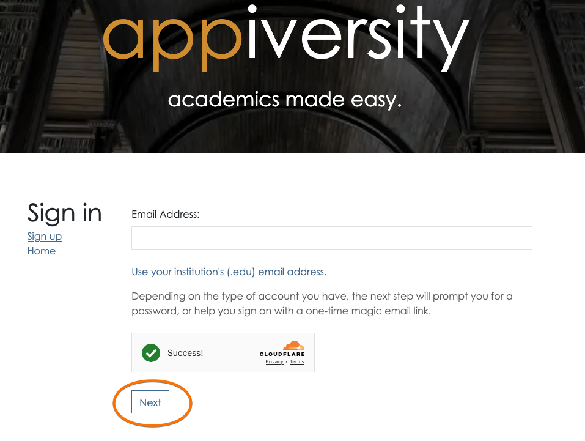

# Sign in and Credentials
There are two ways to sign in to appiversity:
1. With a password (KE Users only - see [users](../users/accounts.md))
2. One-Time-Links - **OTL**s 

The first step is to enter your **email address*, associated with your appiversity account, at the [login](https://appiversity.com/account/login) screen.  There is a  single textbox, along with a [captcha](https://www.cloudflare.com/learning/bots/how-captchas-work/) to prevent automated bots from attempting to log in.  In most cases, this captcha will infer from your browser that you are indeed a real living human being, and you'll be able to simply type your email address and click next!

Based on your email address, you will be redirected to either enter your **password** - for KE users, or you will be sent an OTL and received a prompt to check your email.

Learn more about [Password sign in](./password.md) and [OTL sign in](./otl.md)

## Single Sign On  (SSO)
Accounts with **private hosting** ([learn more](../accounts/private.html)) can also integrate **Single Sign-On (SSO)** for streamlined authentication. We support common SSO providers, including **Google Workspace, Microsoft Entra ID (formerly Azure AD), Okta, LDAP, and SAML-based authentication systems**. SSO allows users to log in using their institutional credentials, improving security and reducing the need for separate passwords. Our team will work with your IT department to implement the most effective SSO strategy based on your infrastructure and security policies. **SSO is a paid add-on** and requires additional configuration to ensure seamless integration with your existing authentication system.