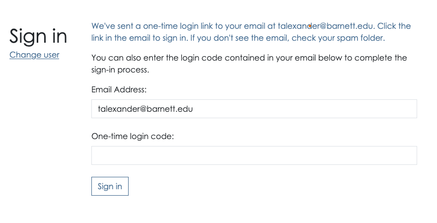
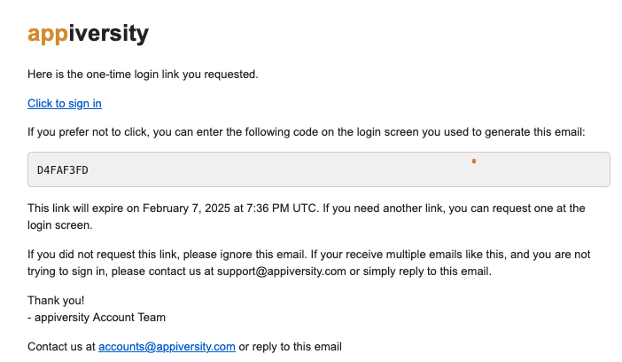

# Logging in with a OTL / Token
For non-KE users (faculty, staff, students), you will be presented with a screen asking for your "one time login code".  This code will have been *emailed to you*.  If you don't receive it after a few minutes, please check you entered your email address in correctly, and also check your spam folders.

The email that your receive contains two things, either of which will get you signed in:

The **link** (Click here to sign in) will take you right to appiversity, logged in - you'll land on your dashboard.  Once clicked, the link is no longer valid.  The link is valid for 10 minutes from the time it was generated otherwise.

If you don't want to click the link, and you are still on the OTL prompt in your web browser, you can also enter the *code* itself - `D4FAF3FD` in the screenshot above in the prompt.  

## OTL and Security
**appiversity** employs **GUID (Globally Unique Identifier)** and **OTL (One-Time Link)** mechanisms to enhance authentication security while ensuring a seamless user experience. These methods are designed to provide strong security against unauthorized access, phishing attacks, and credential-based threats.  

### GUID-Based Authentication Security
A GUID (Globally Unique Identifier) is a 128-bit randomly generated identifier that is unique across all systems. In the context of authentication, GUIDs serve as secure, non-guessable tokens used to identify a user session or authentication request.  

### Why GUIDs Enhance Security  
- **Uniqueness**: Each GUID is statistically unique, making it virtually impossible for attackers to guess or predict valid authentication tokens.  
- **Randomness**: The randomness of GUIDs prevents enumeration attacks, where an attacker might attempt to cycle through predictable user IDs or session tokens.  
- **No Direct Association**: Unlike usernames or email addresses, GUIDs do not directly expose identifiable user information, reducing the risk of credential leaks.  
- **Short-Lived Usage**: GUIDs used for authentication short and defined period, mitigating the risk of replay attacks.  

### OTL (One-Time Link) Security
**OTL (One-Time Link)** authentication is a method where users receive a unique, temporary link via email or another secure channel to log in without needing a password.  That link contains the required GUID described above, and is exactly what appiversity uses for allowing most users to login.

### Security Benefits of OTL Authentication:
- **No Static Credentials**: Since there are no permanent passwords, attackers cannot steal or reuse credentials through phishing or database leaks.  
- **Expiration Control**: One-time links are valid for a short duration, reducing the risk of unauthorized use if intercepted.  
- **Single-Use Nature**: Each OTL is valid for only one login attempt, preventing replay attacks.  
- **Limited Exposure**: Since OTLs are sent via a controlled channel (e.g., email), an attacker would need access to that channel to exploit them.  