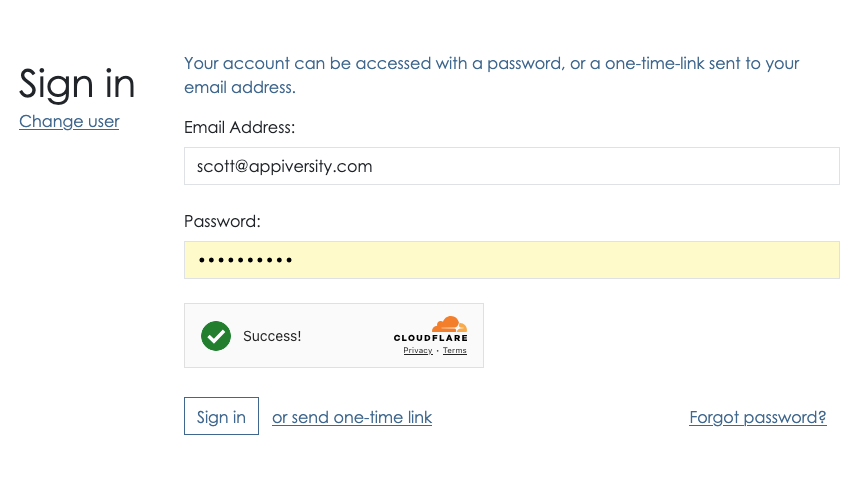

## Logging in with a Password
KE users create passwords when the activate their account.  KE users can always login with OTL as well.  We recommend passwords of over 12 characters, and we also recommend that you avoid reusing passwords as much as possible.  

When prompted, you may enter your password and click "Sign in".

From the password screen, you can also choose to receive an **OTL** instead.  Do this when you either can't remember your password, or you are on a machine that you don't feel comfortable entering your password on.  As described below **OTL** requires access to your email inbox, and the codes are temporary - which are idea for using public computers.

If you have forgotten your password, you can also click the "Forgot password" link to [reset it](./reset.md)
