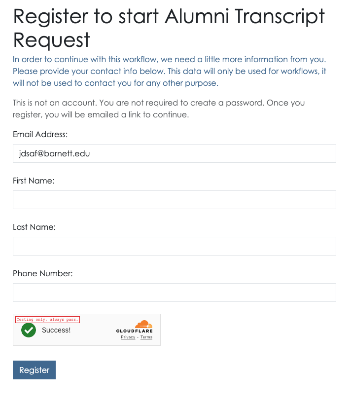

# Public account sign in
In some cases, you will allow *public* people to interact with your institution.  The most common example - a *public workflow*.  In this case, the person accessing the workflow needs to be able to submit the workflow, and it's important we only allow identifiable people to do this to prevent abuse.  

## Email address
When someone requests access to something on appiversity, and they are not logged in, they will always be asked for an email address.  The person will be asked to use their `.edu` address IF they have one, but also that it is not required.

When they enter their email address, we route them through three possible paths:

1. If their email address is associated with an account, or a record in your People listings, then we just route them to the standard [sign in](./index.md) user flow.
2. If their email address is new to us, we start them down the flow of creating a new "Public Person" profile.  See below.
3. If their email address is *already* associated with a public person profile, then they are emailed an [OTL](./otl.md) and can sign on accordingly.

## Creating a Public Person profile
New people access your institution will be asked to provide their name and phone number.  We will *not* contact this person for any reason other than to help them authenticate using [OTL](./otl.md).  You will have access to the information they provide however.

Once they've registered, they can login using an OTL.  Note, this requires the person to have access to the email address inbox they claim to be using - which helps prevent a lot of problems for you, and us.  We can  also block abuse at the email level if a particular person continues to access appiversity in away that either you, or we, determine to be problematic.  