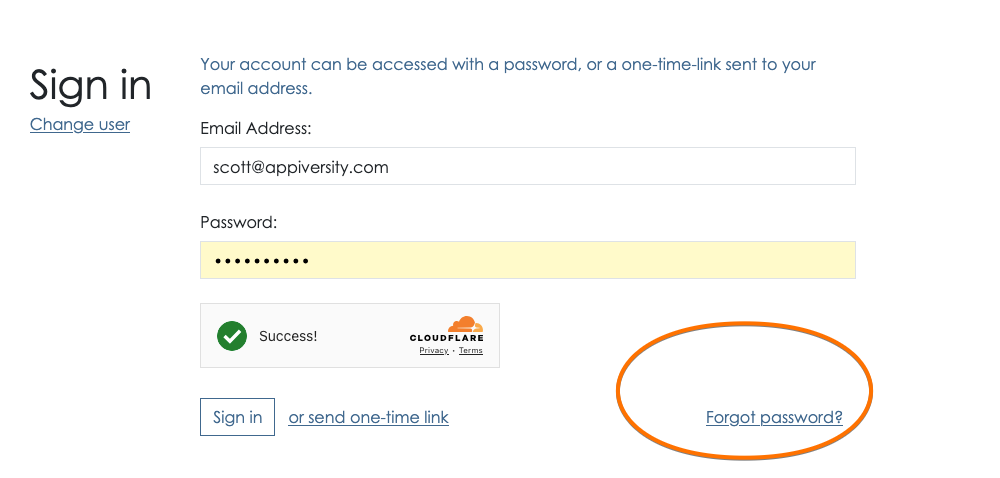

# Resetting your password
When logging in, you may choose to reset your password by clicking on the "Forgot Password" link at the bottom of the login screen.

You've already entered your email address, so if you have an account with us we'll send you a link to reset your password.  If you don't receive it within a few minutes, check that you've entered your email address correctly, and check your spam folder.

The email you receive will have a link, and when you visit that link you'll receive simple instructions to reset your password.  As soon as you reset it, you'll be logged in.