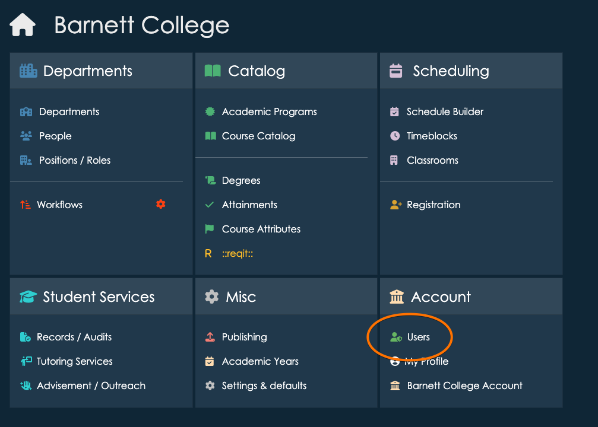
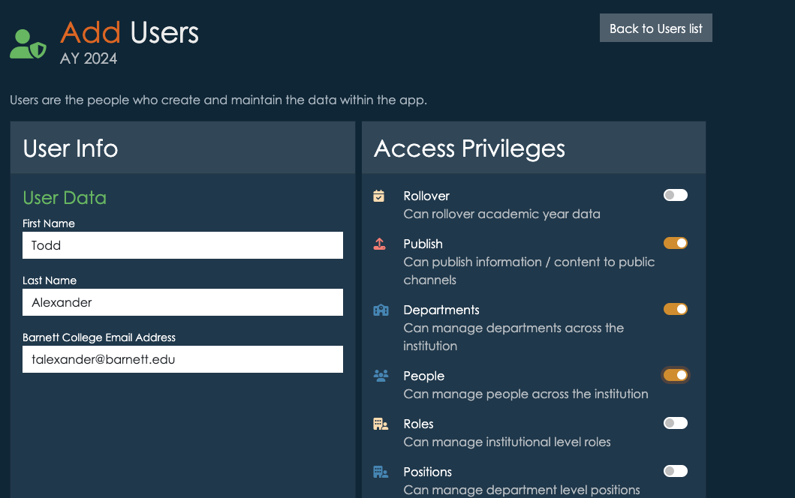
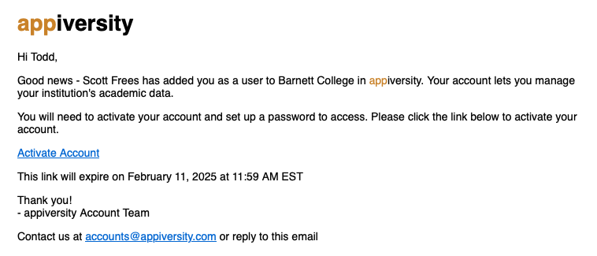
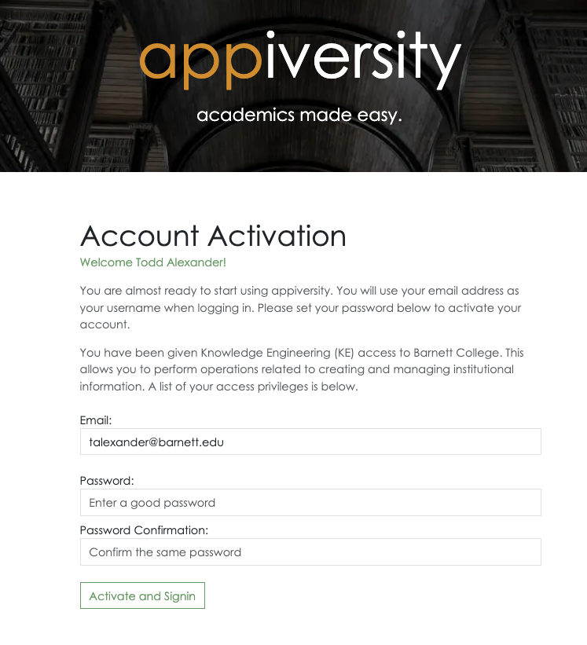
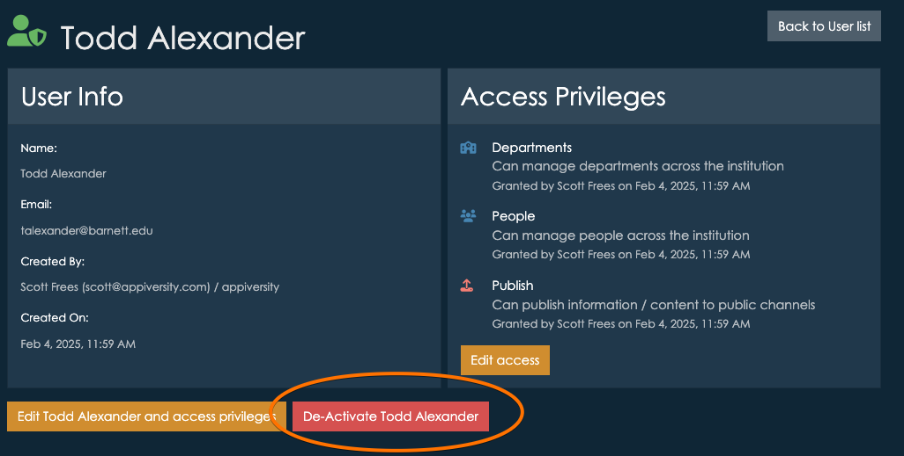

# User Accounts
To access User listings you will need the [Users privilege](./privileges.md).  If you have it, then **Users** will show up on your main dashboard.

Click on **Users** to see a list of all users on your account.  Each user listed will have a set of privileges that they have been given access to.

## Adding a new Users
To create a new users, click "Add User".  All new users require a first name and last name, and an institutional email address.  You will also add access privileges, which can be edited later as well.

Below, we are adding a new users with the ability to *edit* department and people data, and publish data to public channels.

**Important**:  If you add a new user with an email address already associated with someone with a [Person](../departments/people.md) account, that person is automatically "promoted" internally.  You don't need to do anything else - all the functionality "just works" with accounts that fall into both categories.

### Activation
Notice you do not set a password for the new user.  When the user is created, an automated email is sent to the person with an **activation** code and link.  The activation link must be used within 7 days.  

The user may click the link in the email, and they are brought to a page where they create a password.  Once that process is complete, they can log in to their new account.

## Editing Users
You can always select a user from the list and *edit* their account.  You **cannot** change their email address, but you can toggle the various privileges associated with the user.

## De-activating Users
You cannot **delete** a user once their account is created.  This is because we create permanent records of actions performed by users on your data, so you always have a full audit trail of who did what, when.  If users got deleted, it would make maintaining those audit trails a lot more difficult.

You **can** deactivate a user account however.  Doing so prevents the user form performing any further action.  If the person is also in the People listings of department, their deactivation *does not* effect their ability to access the application as a faculty/staff member.

### Signing in
Full Users have a username/password they can use to sign in, and they can also use [OTL](../signin/otl.md).  Those with People, Student, or Public Person accounts may only sign in with [OTL](../signin/otl.md).  When deactivating a user who still has a more limited account, make sure you advise them that while they can no longer user their password to login, [OTL](../signin/otl.md) is still available