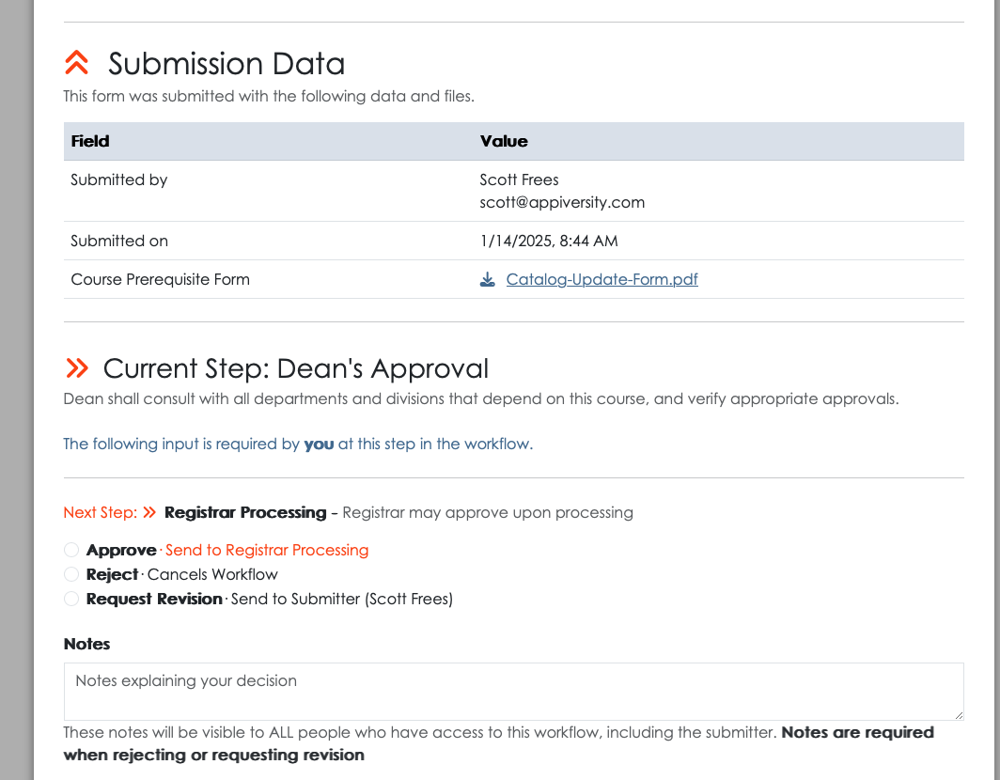
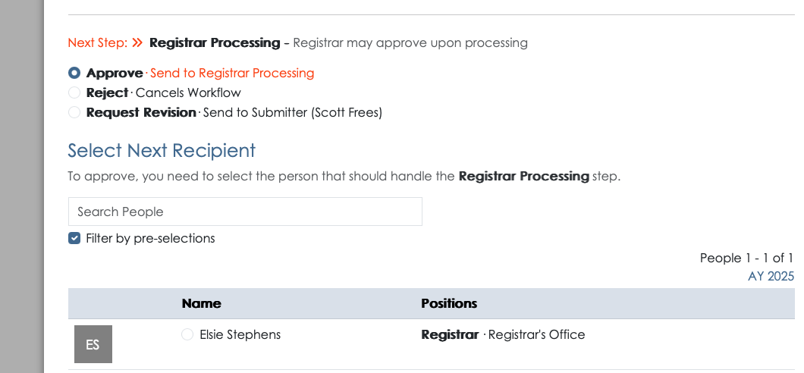
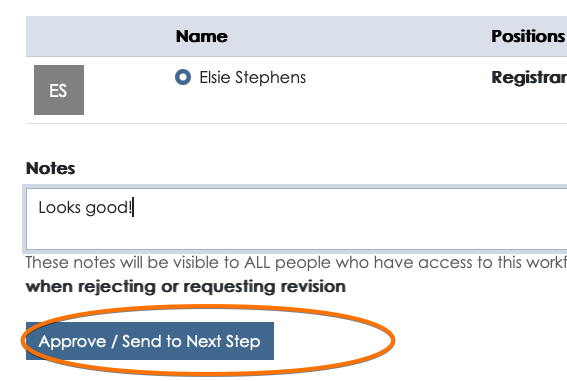
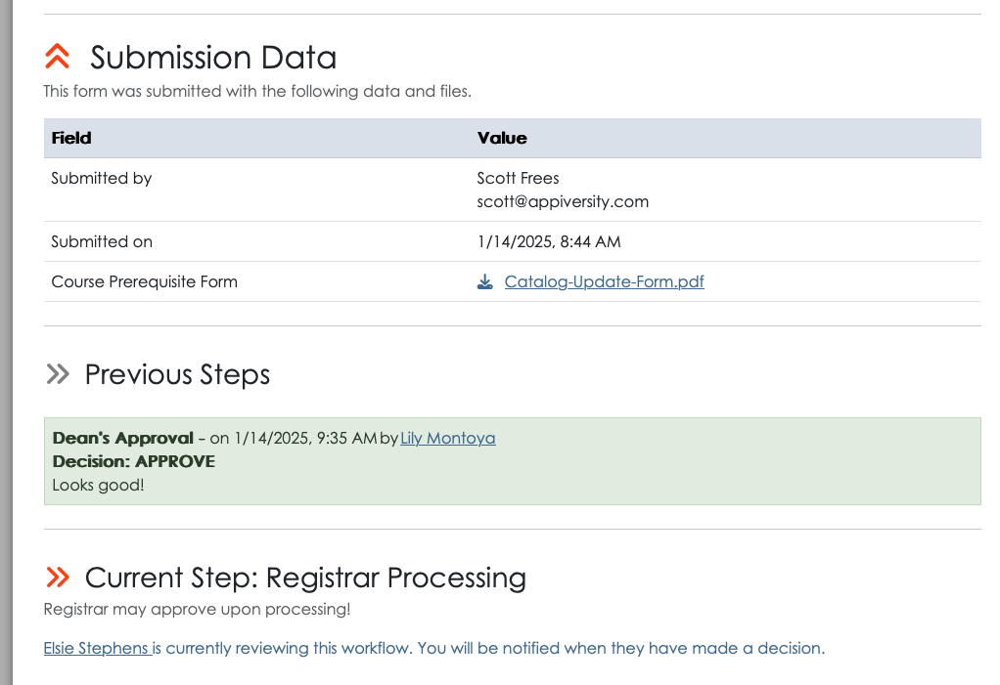
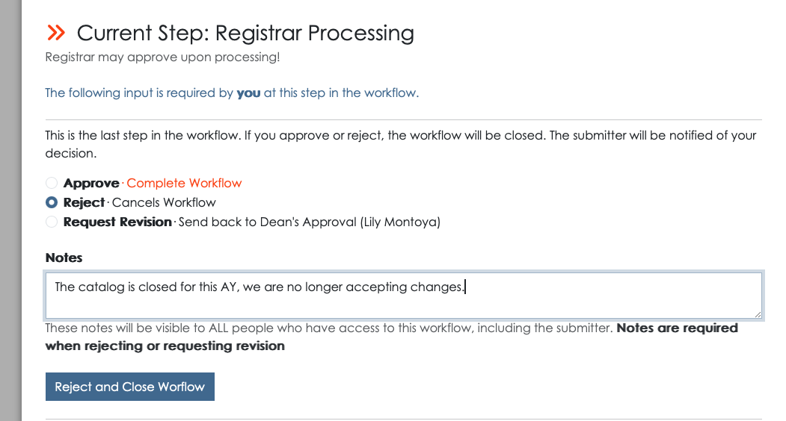
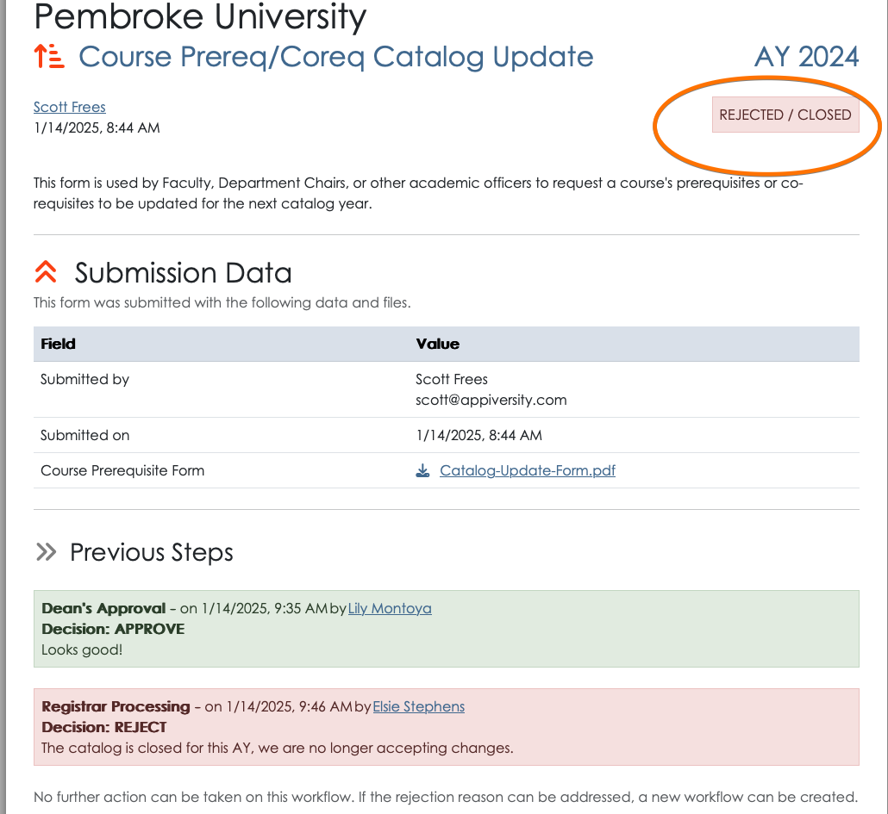
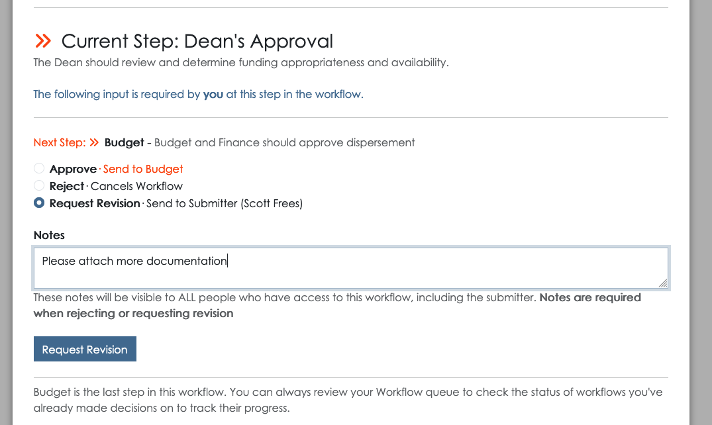
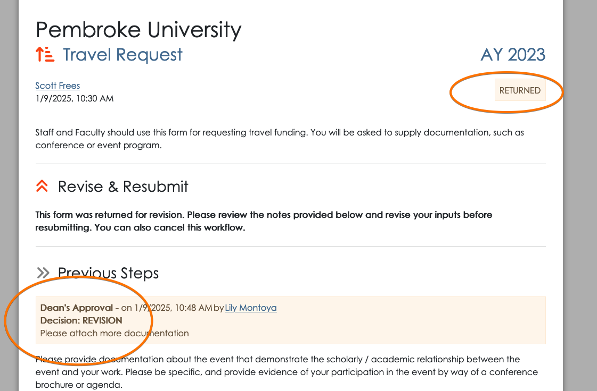
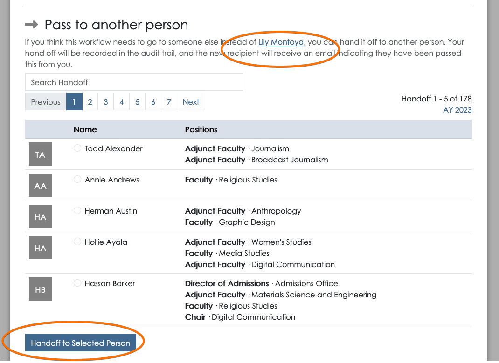

# Workflow Approval Actions
When you access a workflow that you are the **current** approver for, you will be able to take action on the workflow.  Whether you access the workflow from a [permalink](./public-workflows.md) or from your [queue](./workflow-queue.md), you will see the following information:

- Original submission data, including attachments
- Previous actions (approvals) taken
- All data applied to the workflow by previous approvals/actions, if any

## Approval - with next step
If after reviewing the submitted materials you are ready to approve the workflow, you will be required to enter any of the required approval data, as defined when the workflow itself was [created](./create-workflow.md).  The **next step**, if any, will be clearly listed.  You will be asked to select the recipient for the next approval step, based on the instruction that were provided:

You can apply *optional* approval notes, which will be visible to all (including the submitter).  Once you've selected the next recipient, you can click the **Approve / Send to Next Step** button.

At this point, the new recipient will receive a [notification](./workflow-notifications.md) and your actions will be visible to anyone viewing the workflow.

## Approval - final step
On workflows that you are the **final** approver (or the only approval), the interface will be slightly different.  The "Approve" selection will indicate that an approval will *complete the workflow*.  When you approve, you will **not** be asked to select a recipient, and the submitter themselves will be notified that their workflow has been **completed**. 

Once a workflow is completed, it is considered "successful".  Any offline processing that was needed should have also been completed.  The workflow will now be available in the [workflow archive](./workflow-archive.md) and be accessible to any user with **workflow** privileges, any person who approved / rejected the workflow, and the submitter.

## Rejecting a workflow
When you are the next action individual, you also have the option to *reject* the workflow.  This is the appropriate action to take when the request should be rejected outright, there is no remedy for the request.  Rejecting the workflow requires you to note a reason for the rejection.  This reason is visible to all people (including the submitter).  

On rejection, the *submitter* is [notified](./workflow-notifications.md).  The workflow is available in the [workflow archive](./workflow-archive.md) and accessible to any user with **workflow** privileges, any person who approved / rejected the workflow, and the submitter.  The full approval chain, with rejection reasons is viewable.

**Rejecting a workflow is final**, the submitter may submit a *new* workflow if they wish.  If you, as the reviewer, believe the information provided can be amended in a way that would allow  you to approve the workflow, you may also *request a revision* rather than rejecting the workflow.

## Requesting a Revision
When you cannot approve the workflow, but you feel that the information submitted can be corrected, you can choose **Request Revision**.  

If you are the first approver, as is the case in the screenshot above, the workflow will return to the *submitter*.  If you are further down the approval chain, a request for revision will send the workflow back to whoever last approved it.  In both cases, the intended recipient will receive a [notification](./workflow-notifications.md), and your revision **notes** will be visible to that person.  If it is the last approver, they can elect to similarly pass the workflow **back down the chain**, all the way back to the submitter, but requesting another revision.

In the screenshot below, you can see what the *submitter* will see when their workflow is returned.  The status is clearly marked as **RETURNED**, and the reason is listed in the **Previous Steps** area of the workflow.

## Passing a Workflow to someone else
There are times where a workflow might arrive in your queue, but you aren't the best person to review the submission.  This could happen for many reasons:

- You are away, and someone is covering for you.
- The submitter (or previous approver) made an error identifying you as the next recipient.
- You are sharing duties with a colleague, and they are handling the approval.

Regardless of why, you can *always* pass off the workflow to someone else.  Just scroll down to the **Pass to another person** area of the workflow, select the person you are looking for, and click **Handoff to Selected Person**.

There's always an audit trail - so the handoff will be listed in the actions taken on this workflow.  

**Note**:  Any appiversity **User** with the **workflow** account privilege can view any workflow, and can also initiate a *handoff* of any workflow. This features allows someone to go into another person's workflow queue and hand off flows - perhaps because that person is out sick, and cannot do this themselves.  The audit trail ensure that this feature is used with full visibility - it will be clear *who* handed off a workflow, *to who*, and *when*.  Users with **workflow** privilege **cannot** approve/reject/revise workflows in someone else's queue - but they can hand it off to someone else.