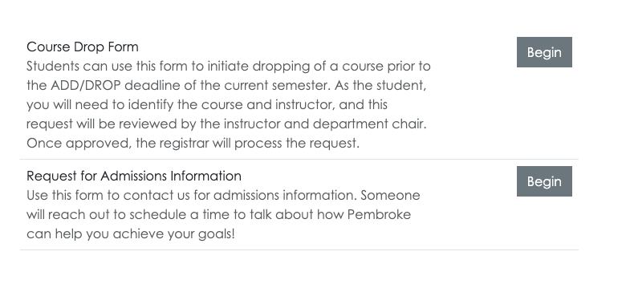
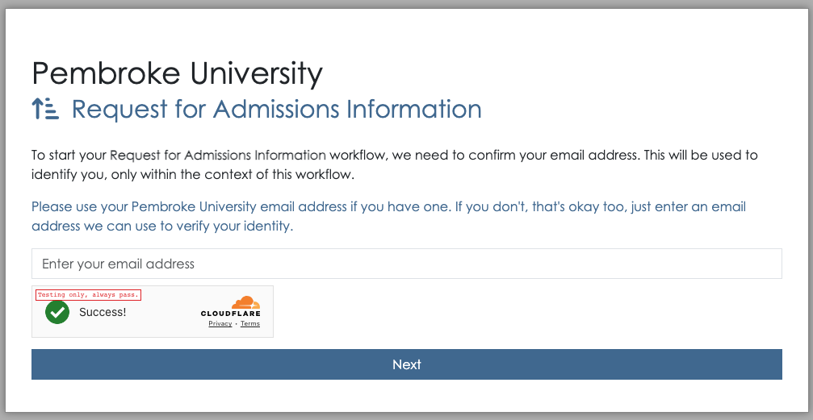
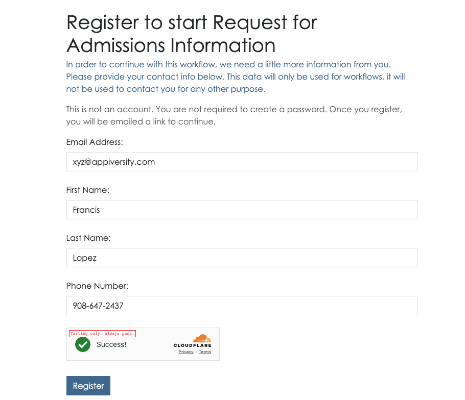
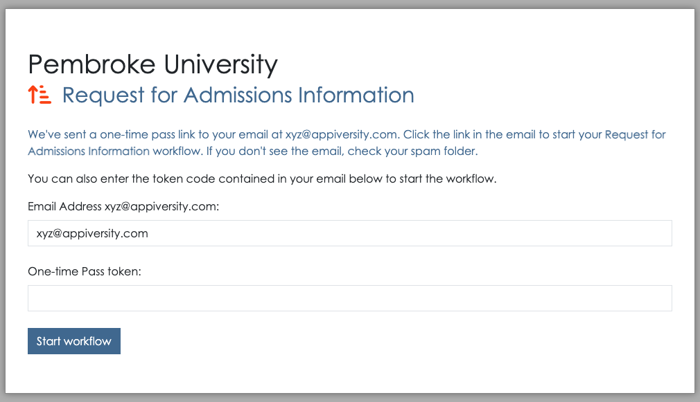
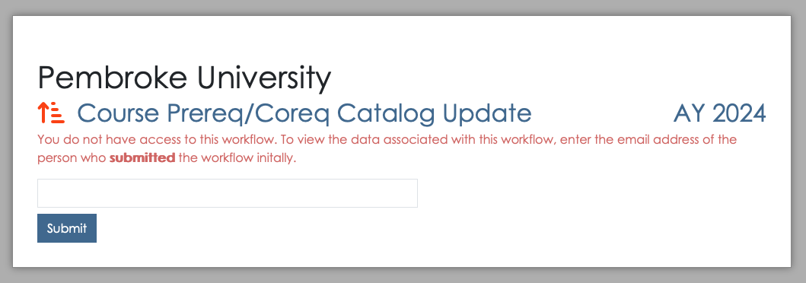
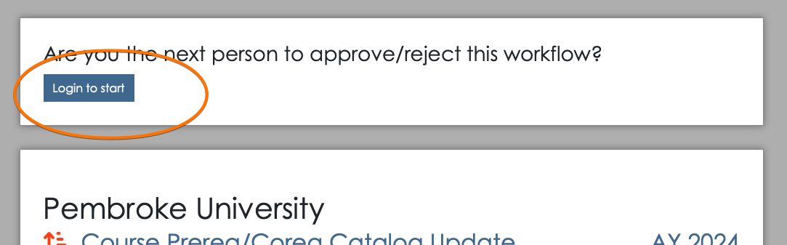

This document is a user guide for starting an existing **public** workflow.  It describes the sequence of steps a user will perform to start a workflow when they do not have an appiversity account.  This is the situation where you've [published a workflow](./publishing-workflows.md) and the form is to be started by students or anyone not affiliated with your institution.

Restricted workflows, which require appiversity login, are [discussed here](./starting-workflow.md).

## Public Listings and Active Academic Year
Unlike most things in appiversity, workflows are *frequently* accessed by people who are not logged into the application.  When non-logged in people access workflows, they are typically accessing them via [published HTML listings pages](./publishing-workflows.md), or from links they have saved (for example, in an email).  

Workflows can only be **initiated** or **started** if they belong to the current academic year.  Checkout the workflows section in our [active AY](../academic-years/active-ay.md) guide for more details.

## Submitting a Workflow as an unaffiliated user
Workflow listings can be published in a variety of ways, but the most common is through an `iframe` listing, which depending on custom styling may look something like this:

This listing might appear anywhere on your institution's public-facing website (see [publishing](../publishing) in general, and specifically [publishing workflows](./publishing-workflows.md)).

Clicking **Begin** will start the submission process.

If the user is not logged in, they will be asked to provide their email address.

If the email address does not match an appiversity user, or an institutional (People) user, then appiversity treats this person as an *unaffiliated* person, or "Public Person".  If the email address has already been used to register, a one-time-link to access/start their workflow will be **emailed** to them. 

If the email address provided does not match an existing record, they will be prompted to register.  Note that this registration process collects very limited data, it is only used to verify email addresses (see note below).

Once the registration information is collected, the user is notified that a one-time-link has been sent to their email address.  This link (and code contained within the email) can be used to continue on to workflow submission.

At this point, the workflow form looks the same as if the user was a full appiversity user.  The only difference is the top navigation bar, which **only** contains a **Workflows** drop down listing.  This listing will include all the other workflows (if any) that were submitted by the same email address.

**Note** appiversity takes precautions against SPAM and bot submission of Workflows.  No workflow can be submitted unless the email address provided has been validated, using the one-time-link provided in the email address.  If in the event someone's email address becomes compromised, and workflow submissions are being created with malicious intent (flooding workflow queues, for example), we can blacklist the email address.  Contact [support for requests and assistance](mailto:support@appiversity.com))

## Accessing a Submitted Workflow with a Permalink
Every workflow submitted is a assigned a globally unique identifier, which is part of it's *permalink* URL.  It looks something like this:

`https://appiversity.com/flow/57bf73fe-932a-4c71-ad2e-61fab3842057`

The alphanumeric string following `/flow` is called a *globally unique identifier* and it really is global, and unique.  [It's nearly impossible to guess](https://betterexplained.com/articles/the-quick-guide-to-guids/) - but as an extra layer of security, appiversity will *challenge* any access to a workflow using the permalink when the user is not already logged into appiversity.  In order to access the workflow, they must know the email address **of the person who submitted the workflow**.

This extra layer makes sure no one can just try to "guess" random permalinks and gain access to workflows.  

Note that when accessing a workflow though this challenge sequence, the user still cannot take any action on the form.  In order to take action (if they are the approver), they will need to login to the system.

When a permalink is accessed from a web browser where a user is already logged in, the challenge sequence is bypassed, and the user is shown the workflow according to their access level.  

If the logged in user **does not have access** to the workflow however, then the challenge sequence is again shown.  This is a convenient way for people to share read-only access to workflows, they just need to share the permalink **and** the submitter's email address.  Think of it as a lightweight handoff - you can send someone this information and ask them to take a look at a workflow that isn't in their queue, just for some advice or assistance, in a read-only fashion.
