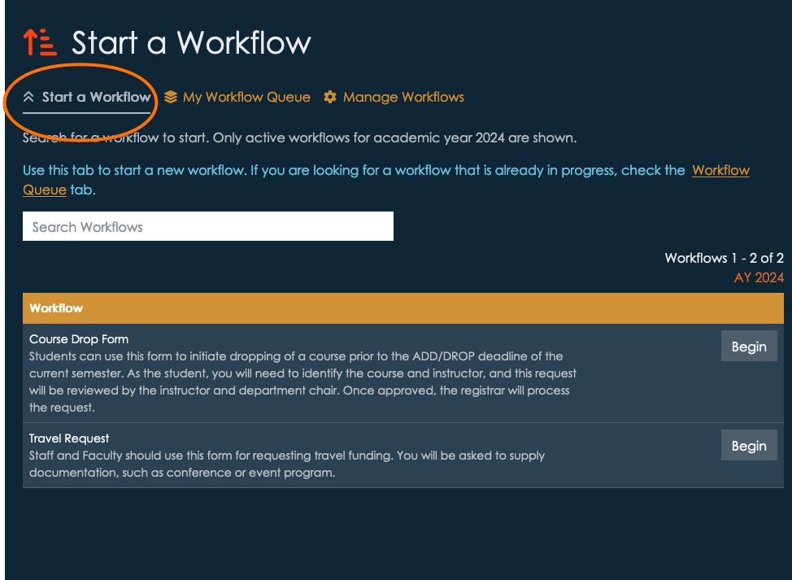
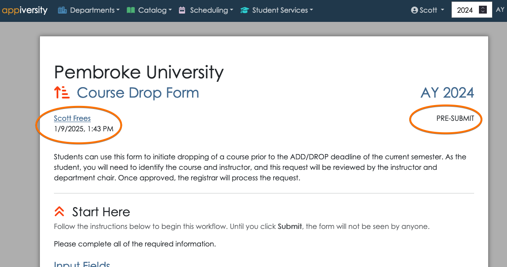
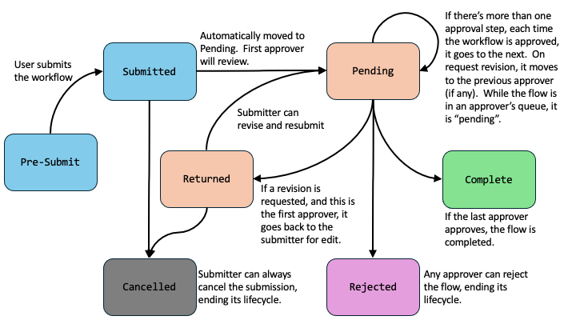
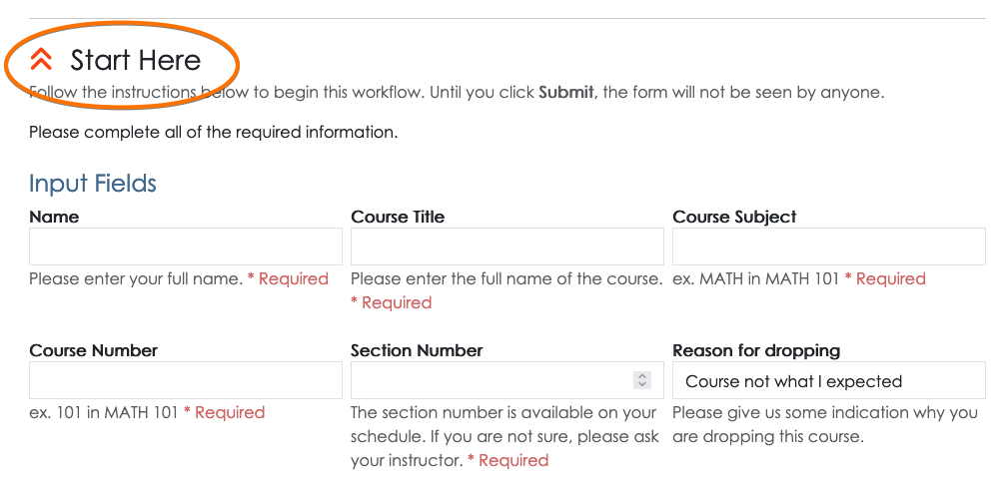
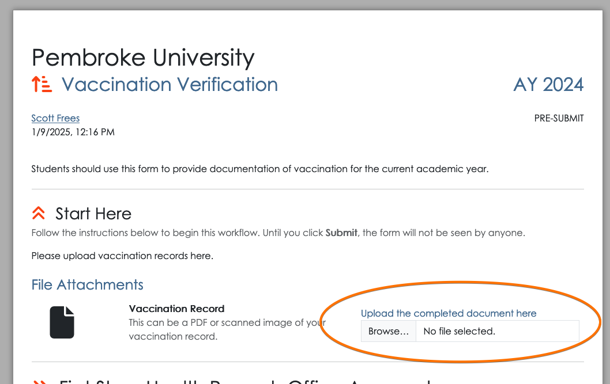
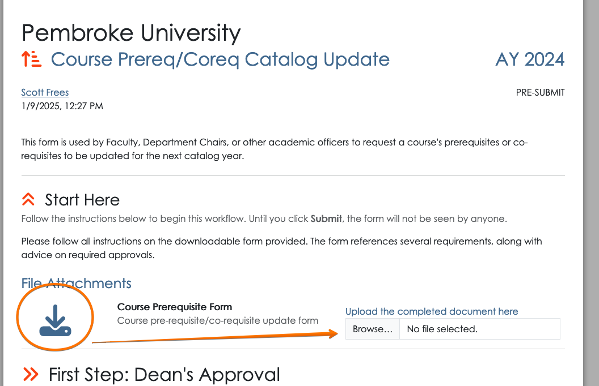
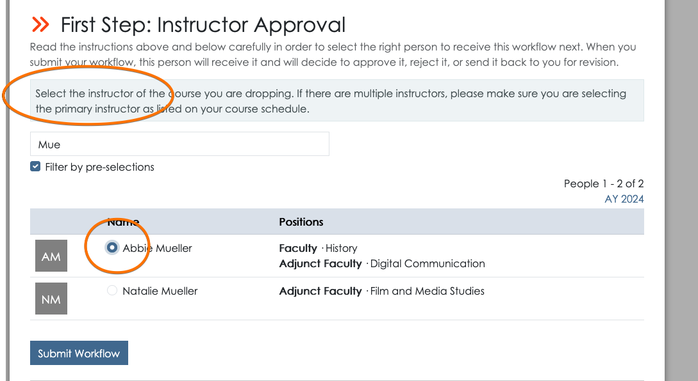
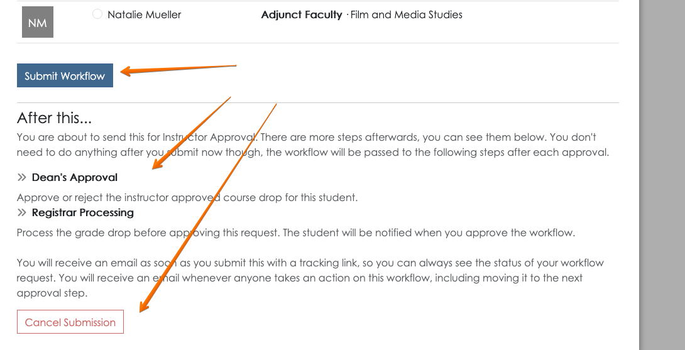
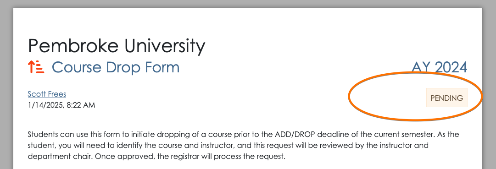
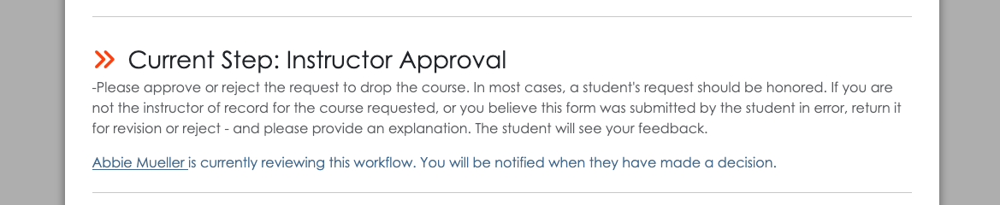

This document is a user guide for starting an existing workflow.  It describes the sequence of steps a user will perform to start a workflow **when they are already logged into appiversity**.  For public workflows - to be started by students or anyone not affiliated with your institution (they do not have an appiversity account), the process will be similar, but you should review the [public workflows guide](./public-workflows.html) too.

# Finding a Workflow
All active workflows, whether they are public or restricted, are found in the Start a Workflow tab in the workflow page within appiversity.

You may search among workflows in the search bar provided.  To start a new workflow, find the one you are looking for and **click Begin**.

# Submission Input
After clicking begin, a new **workflow instance** will be created and you will be redirected to begin submitting it.  A few details to note:

- The link at the top of your browser will appear differently.  For example, the URL for the screenshot below is http://appiversity.com/flow/fc71721e-6cea-475e-b219-ad2ff34dd1d6.  (Don't try it, it's not active anymore :).  This is a *permalink* to the specific instance of your workflow that you are filling out. 
- The interface we'll walk though now will look the same whether you are logged into appiversity with a **People** account (you are faculty, staff, etc), , or a non-affiliated *public person*.  You'll get to this screen differently if you are a student or a non-affiliated person, and that's described [here](./public-workflows.md).

Take note that the front matter of the workflow always displays the **submitter**, along with the timestamp the workflow was started.  This is displayed on the top left.  The workflow **status** is also always displayed, at the top-right.  When you begin, the workflow is in the *pre-submit* stage.

## Workflow Stages
A workflow goes through a lifecycle of stages.

- **Pre-Submit** - a workflow that has been started, but the submitter has not yet submitted it for review.  The submitter can return to the workflow at anytime (they will need the link to it), but no one else can access it.  
- **Submitted** - as soon as the workflow is submitted, it will transition from "submitted" state immediately to "Pending".  This is just an intermediate step that used internally.
- **Pending** - When a workflow is in the pending state, it's being reviewed.  Depending on how many steps of approval has been defined, many interactions can happen while in the pending state.  Each time an approver passes the workflow to the next approval, the flow is still pending.  If an approver request revision, and it goes *back to a previous reviewer* - it's against till pending.
- **Returned** - When an approver requests a revision, and there is no previous approver, the flow goes back to the submitter.  The submitter can edit their submission data, and resubmit.
- **Rejected** - Any approver can reject the workflow.  This terminates the lifecycle.
- **Cancelled** - A submitter can cancel their submission whenever it is in their hands.  This means they can cancel the submission if it is in the *pre-submit* or *returned* state.  A user cannot cancel a submission while it is being reviewed by an approver.
- **Complete** - The final approver may complete the flow by approving.  This terminates the workflow's lifecycle.

You can visualize the lifecycle as follows:

All workflows are archived, and can be searched by any appiversity **user**.  Submitters can find their own workflows through the archive, and approvers can do the same.  The only workflows that are *not* archived are flows that are cancelled before any approver acts on the workflow.

[Notifications](./workflow-notifications.md) are triggered on every state change, and every time a workflow is moved into another person's queue.

## Submission Data
Before moving forward, the user will be required to enter all required submission fields, which were defined when the [workflow was created](./create-workflow.md).  All of the input fields are found under the "Start Here" section.

## Uploading submission documents
If the workflow has defined documents for submission, these will be displayed in the submission area.  Required documents block submission until they are uploaded.

Note that if a document was provided as part of the workflow, for example **a legacy form**, it will be available via a link to download.  Here's an example:

In this case, the "Course Prerequisite Form.pdf" document presumably is your institution's fillable PDF for instructors to request a course prerequisite to be changed in the catalog.  The **submitter** would download it, by clicking the link.  The submitter then fills out the form, and **uploads it** as part of the submission.  This allows you to quickly leverage existing forms within Workflows.

 
# Submitting the Workflow
When submitting a workflow, a *recipient* must be selected.  While [creating the workflow](./create-workflow.md) the first approval step may  have been created with pre-selection criteria - a role, position, or actual person.  In addition, the instructions associated with the workflow should also provide guidance to the person submitting the workflow as to who should receive it.  This is the same concept you are used to with sending electronic PDF forms or paper forms - the person filling out the form must in some way make a decision in terms of who to send it to!

The instructions for recipient selection will be shown above the search field for selecting a recipient.  The user can use the search box to find the appropriate person, check their name, and click **Submit Workflow**.

Below the submit button the user is also given additional context, where they can see what *other* approval steps will be taken on this workflow.  This helps the submitter understand what will happen to their request after they submit, and adds transparency to the process.  They also have the option to *cancel* the workflow and not submit it.

# Next steps
When you are the submitter of a workflow, you'll have full visibility into who is taking what actions on it from that point on.  The submitter will receive an email after submission that contains the permalink to their workflow.  At any time, they can use that link, or they can find their workflow in the **My Workflow Queue** to check it's status.  Navigating to the workflow, they will see the workflow status as *pending* and be able to see who is currently reviewing the workflow.

Check out the following guide topics to learn more:

- [Workflow Queue](./workflow-queue.md)
- [Workflow Notifications](./workflow-notifications.md)
