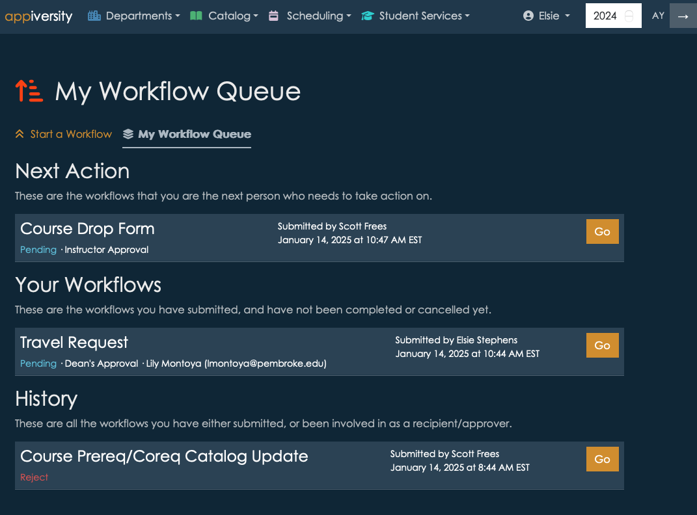

# Workflow Queue
For anyone with an appiversity account (Users, People, and Students[^student]), the **My Workflow Queue** provides a complete listing of workflows they have been associated with.  

The workflow queue shows all workflows **for the selected academic year**.  It is broken into **three** sections:

## Next Action
The next action list contains **active** workflows where **you are the next reviewer**.  This list contains workflows that are waiting for **your review**.  They will be listing as "Pending", and display the workflow title, submitter, and step. Click go to visit the workflow add your approval, rejection, or request for revision.

*The Next Action section will only be present if you are the reviewer for at least one active workflow*.

## Your Workflows
This list contains workflows you personally have submitted, and are either **pre-submit** or **pending**.  This listing can become somewhat cluttered if you abandon lots of workflows before submitting them, as they are saved for you to continue them.  To clear out abandoned workflows you no longer intend to submit, simple click the **Go** button, scroll to the bottom of the workflow, and click **Cancel Submission**.  The submission will still show up in your *History* section however.

## History
The History list show **all** workflows you are associated with - no matter what their status is.  This list can become quite long if you are a frequent recipient of workflows, and the list can be filtered and searched to more easily find workflows when needed.  

## Full History
For **Users** with the **workflow** privilege, their *History* is modified to include **all workflows** for the current academic year.  This is the full and complete archive of all workflows flowing through appiversity within your institution.  

# Workflow List (for unaffiliated people)
Unaffiliated (Public People) users can access a listing of the workflows they themselves have submitted. Recall, these users must [register to submit a public workflow](./public-workflows.md), and this registration allows us to link forms submitted by the same person (or email address). Whenever they visit a workflow (via a permalink), the top left of the navigation bar will contain a list of workflows they have initiated, with a timestamp.  

[^student]: For accounts that are using Registration and Records, students have limited accounts, and can access their own workflow queue through appiversity.  Otherwise, students utilize the public workflow list as described above.