# appiversity Workflows 
Workflows can replace the paper forms, Word documents, and PDF files that you are circulating via email to drive **approvals** and **workflow**.

Here's the scenario to think about:
- A student wants to drop a course.
- The student needs to fill out a form, and get their instructor's signatures.
- From there, they may need to have that form forwarded to the department chair or dean for another round of approval.
- Lastly, the form is forwarded to the registrar, where the request is processed.

This scenario get's repeated within academics countless times - from student requests, faculty travel requests, course scheduling modifications, graduation applications, etc.  

Ten or fifteen years ago, most institutions did this with *paper* forms, where each person along the approval chain needed to sign the document.  There's a certain convenience to this - there's just one copy of the form, and it's easy to fill out.  It's wasteful, and expensive though - and forms get lost.  

Then we all started *digitizing*, and it went something like this:
- Paper documents were converted into PDFs, but they were really difficult to "sign".  People printed them, filled them out, signed them, scanned them, and emailed them.  This didn't help much!  
- PDFs were then made "fillable", which helped, since now at least the form data didn't need to to be handwritten anymore!
- PDFs could be digitally signed - either by drawing a signature, attaching a photo of a drawn signature, or using a *digital signature* that needed to be created and configured on the user's computer.  This seemed right - but of course getting the signatures to reliably work, on everyone's computer, was a nightmare.

Ultimately, we replaced wasteful paper forms with *thousands* of email attachments, IT headaches configuring digital signatures (which really aren't necessary - these aren't exactly legal documents!), and aggravation.  

After all that, those digital documents remain in *everyone's* email archives - there's no repository for them.  There's no **real** paper trail at all!

Some institutions, recognizing the inefficiencies, adopted tools from the legal and real estate industry, which managed the digital signing of documents across approval chains without installation and email forwarding - *but they are expensive*.

Workflows  offers an alternative.  With workflows, you can easily create your forms and publish them in a searchable listing.  Users can fill forms, and get data prepopulated - which drastically improves accuracy.  You can create approval chains, and the form is instantaneously routed to where it needs to go.  Every step along the way, there is a full audit of who's approving, and when.  All stakeholders can see the status of the approval and workflow.  When the workflow is complete, it's archived and searchable from one place - by everyone.  

Finally, *workflows is free* (although long term retention is limited to paid plans).  It's included in the **Kickstart** package. 

This document is an user guide for getting started with Workflows.  We'll walk you through creating new workflows, defining approval chains, using document attachments, and managing access.  **Let's get started!**

# What's a *Workflow*?
When we talk about a Workflow, we are referring to the entire process associated around a particular approval or workflow sequence.  

For example, **Course Drop** is a **workflow**.  It requires the *initiator* (presumably a student) to populate a form documenting which course they are dropping.  This information is then *approved* or rejected by a sequence of people - the instructor, the chair, the dean.  The information passed to the registrar for processing.  This entire process is a **workflow**, and each step is a **workflow step**.

Whe we say "Create a workflow", we mean *creating the entire process sequence*:
1. Defining what data needs to be entered to initiate the workflow
2. Defining each approval step
3. Defining what each approval step may add to the flow.  For example, attaching additional documentation or data.

**Creating a workflow** is different than someone *starting* a workflow - or *initiating a course drop*.  Think of **creating a workflow** as **creating** the form.  You do that once (or at least once in a while).

## Who can create a workflow
Remember there are different [categories of stakeholders](./user-categories.html) using appiversity at your institution.  You have *people*, who are staff members, faculty, employees.  You have students.  You have *public* people - who are not necessarily associated with the institution at all.  While these stakeholders might *start* or *initiate* a workflow, they aren't the people who will be **creating the workflow in the first place**.  

Only appiversity **users** with the **Workflows** account privilege may create, edit, delete, and rollover workflows.  You can check a user's profile (or your own) to see if if this privilege has been granted:

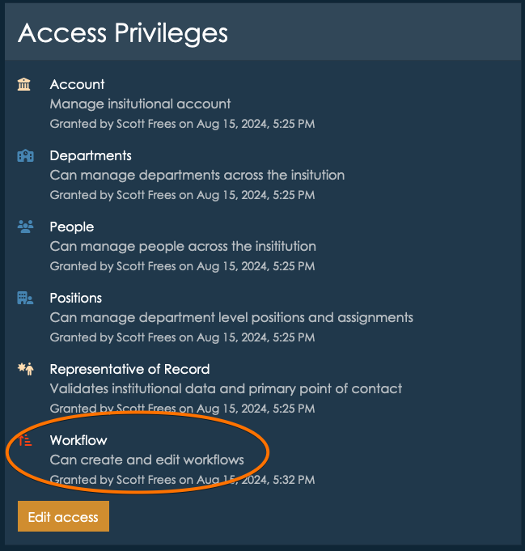

# Creating your first Workflow
Workflows can be accessed from the institutional home page or the main toolbar.  The cog icon is a short cut to the management area of Workflows, which is where you will create new workflows from.
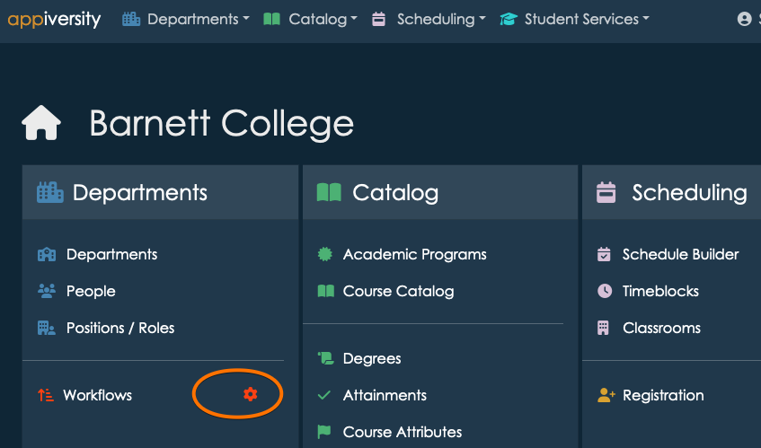

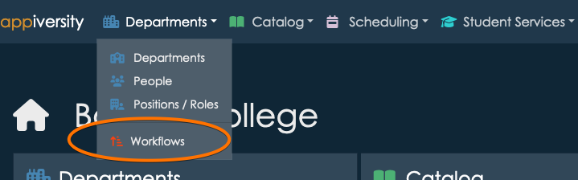

Once you arrive at the Workflows screen, you have three tabs at the top:

1. Start a Workflow - this is where you can initiate a workflow that already exists.  Anyone who is in **People** can access this tab, and start a workflow. 
2. My Workflow Queue - this is where a list of workflows already initiated by you, or that you are an approver on are listed.  Think of this as your "inbox", and also your archive.  We'll talk more about this later after we create a few workflows to use.
3. Manage Workflows - this is where we will visit first.  It's where we create workflows.  **Note** if you do not have the Workflows privilege, you will not see this tab!

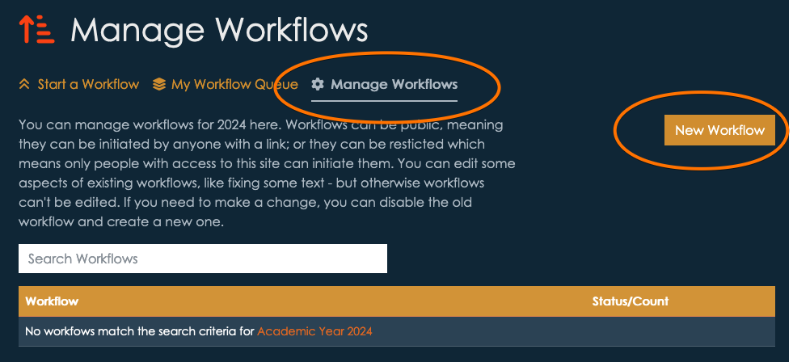

**Click New Workflow** to create a new workflow:

## Defining Workflow Data
Workflows consist of *workflow data*, which is information about the workflow process in general. This includes it's name, a description, and access flags.  

### Active / Inactive
Workflows can be set to **active** or **inactive**.  Active workflows can be started, while inactive workflows cannot.  Keeping a workflow *inactive* while it is a draft, or until you want to allow access is generally a good idea.  Once a workflow is started by someone, the workflow process itself cannot be deleted.

Note that workflows can by **rolled** over from AY to AY.  You'll notice that you are activating the new workflow for a given AY.  The workflow will rollover to future AYs (during the normal [rollover process](./rollover.html)) with the same Active/Inactive state.

### Restricted vs Public
Workflows marked as **public** can be initiated by anyone. This setting makes sense when the workflow is something a student would start (an Add/Drop request for a course), or even workflows that might be initiated by completely external people (maybe an inquiry).  "Public" workflows still require the submitter/initiator to provide a verifiable email address, but they do not need to belong to the institution.

Workflows marked as restricted can only be initiated by an appiversity user, they need to be logged in. This includes anyone with a full **User** account and anyone listed in **People** (ex. faculty, staff).  Restricted makes sense for workflows like a special payment form, or a grade change that can only be initiated by faculty.  Restricted workflows will never be listed in [published](./publish.html) listings, they can only be started from within appiversity itself.

Let's start by creating an example for **Course Drop**.  We'll give it a title and description, and mark it as **active** and **public**, since it may be initiated by a student.

GUIDE WATCH OUT:  Students will become users eventually, so this is an area where this guide might need to be updated.  Likewise, once Catalog and Schedule integration are complete, the UX here is going to be updated.

Once you've filled out the necessary data, click **Next** to move on to *submission data**.

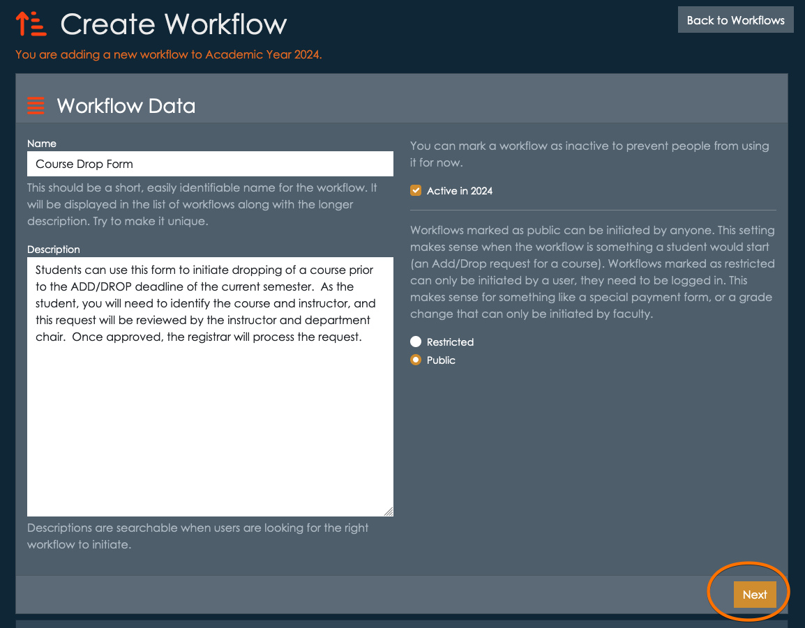

## Defining Submission Data
Submission data is the information that the form's initiator must provide to start the workflow.  You are required to provide *instructions*, which can be as simple as "Please fill out all required data", or can include additional contextual information.  The person *starting* this workflow will see these instructions, so consider your audience!  You will have the opportunity to provide instructions to *approvals* separately, these instructions should only be addressing what someone needs to know to *start* or *request* the workflow.

GUIDE WATCH OUT:  This area will need to be updated when Markdown is enabled, and link to the Markdown guide.

Next, you can add *submission fields* and *submission documents*.   This is where you have the freedom to reuse as much or as little of your institution's existing processes as you like.  

### Submission Document Attachments
If you already have a PDF or Word Doc that you are happy with, any you just want to use Workflows to manage the approval process, you might want to simply adopt a single submission document here.  You can upload an empty form in this area, and each time someone wants to initiate this workflow they will be asked to download the form (they will be given a link), fill it out, and upload it.  That filled out form will be passed along and viewable to all the approvers.  By using document attachments here, Workflow is removing the need for email forwarding, email attachments, and signatures - but you are **keeping** the data input functionality of your existing forms.

**Note, you can define multiple submission documents** that the submitter must fill out and upload for a single workflow.

### Submission Fields
You can use submission fields to define data inputs that will be available to users directly, through the web interface.  Using submission fields is a great way to create workflows because they are the fastest way for users to enter data - no downloading, editing, and uploading.  They are also faster to approve, since the submitted data will be displayed in an easy to identify and accessible way to everyone reviewing the workflow.  Submissions fields can be of several types:

- Text - short text input fields, like someone's name.
- Long Text - a longer text input where you might ask the submitter to provide a lengthy explanation or justification of the text.  This won't permit a lot of formatting, so consider submission document attachments if you want to receive elaborate formatting here.
- Number - numeric input field
- Date - date input
- Checkbox - suitable for true/false, yes know.
- Choice - create a list of options for the user to choose from

You can add any number of submission fields.  Each field will require you to define it's name (primary label visible to the user), description (briefly explains to the submitter specific instructions about this field), and whether or not it is a **required** field.

### Hybrid Submission
Of course, you can use **both**.  If there are some forms that you'd like to use PDFs, Word, or any other type of document for, they can be used together with any number of submission fields too.  At each step along the approval chain, all submission data fields and all documents are accessible.

For demonstration, let's build the Drop Course form so it requires a user to enter their name, the course's title, subject, course number, section number, and an indication of why they were dropping the course - a choice between "The course is not required for me", "The course isn't what I expected", and "Other".  This isn't something you generally find on Course Drop forms, but as an example it gives us a chance to demonstrate the choice list fields.

GUIDE WATCH OUT:  Update the data entry here for course selection when catalog integration is complete.

Adding the student's name (you should probably ask for some other form of more specific identifying information), along with course data is best as a series of Text inputs.  Since course numbers sometimes have alphabetical values (such as 101L for 101 w/ Lab, for example), use Text instead of Number if there is *any* doubt.   

For each, select the Text button, and fill out the necessary information. Let's also mark each as *required*.

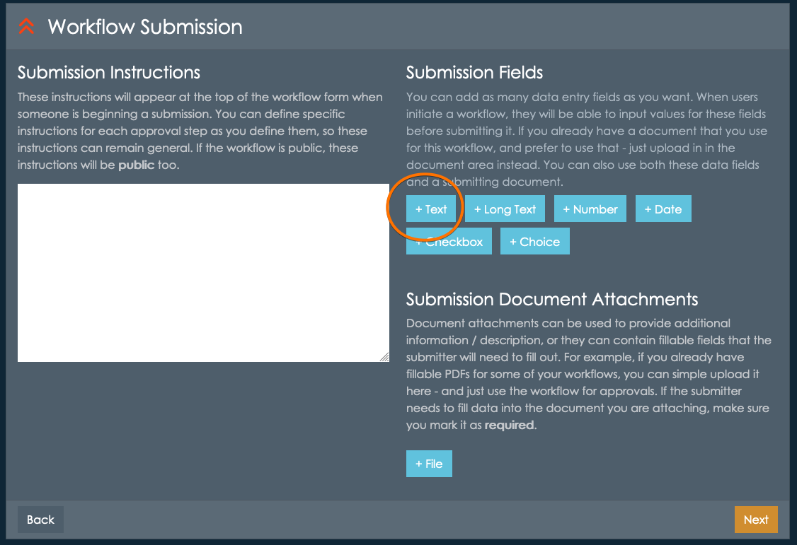

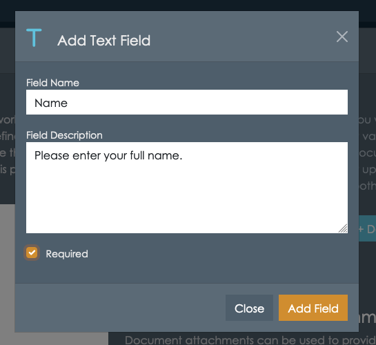
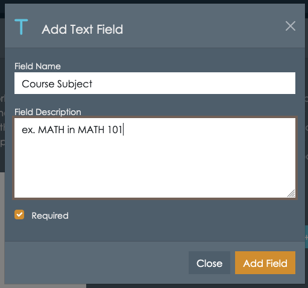

etc. etc.

For the choice list describing *why* the course is being dropped, the dialog box will ask you to 
provide the options users can choose from.  Remember, each option must be separated by **semi-colon**.  
This does mean that an option cannot have a semi-colon within it, as that is what is used as the delimiter.

#### Display Order
When someone starts a submission for this workflow, the input fields are displayed in the same order 
they are listed in on the submission building screen. You can use the up and down arrows to re-order the fields.

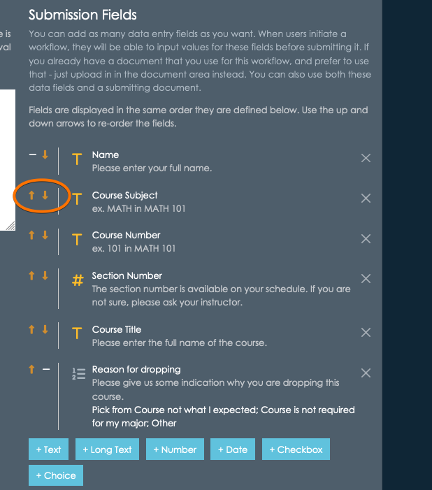

#### What about email address?
You might be wondering why we aren't capturing the student's email address.  Remember that when someone starts this workflow, *they are required to supply an email address*.  If the user is logged into appiversity (they are in the Users or People groups), then this information is already known.  If they are not logged in, they will be asked to *verify* their email address - which is a simple and fast process that ensures the workflow is being started by the owner of the supplied email address.

The users's email address will be available to anyone reviewing the workflow, at all times.  Therefore, you normally do not need to capture this type of data.  

For restricted workflows - where the workflow can only be created by someone in the Users or People groups, you don't even need to capture their name!  All identifying information about the user who is initiating a restricted workflow is automatically added to every workflow.

## Defining Approval Steps
Once you've completed the submission data fields (and documents, if you wish), it's time to move on to the approval chain.  Each workflow must have at least **one** approval step.  In the simplest workflow, a submitter may fill out information and submit it to the sole approver - who would approve/reject/process the workflow request without any other input from others.  In other workflows, you might have a much longer sequence of steps - where multiple stakeholders must approve the request before final processing.  On each approval step, you can define **additional** instructions, and also ask for **additional** data to be added to the workflow. 

Every approval step will allow the "approver" to (1) **approve** the workflow, sending it to the *next* approver, or marking it as complete, (2) **reject** the workflow, marking it as "rejected" and notifying the submitter, or (3) **request revision**, which will send the workflow back to the last person who either approved or submitted the workflow, with a reason for the request.  In all cases, the people who need to know will receive notifications via email that a workflow item is "in their queue" - whether that's because they are the next approver, or because it's been kicked back to them as a request for revision.

At all times, the *submitter* will be able to see **who** has the workflow.  This creates much more transparency to workflows - no more emails that go missing!

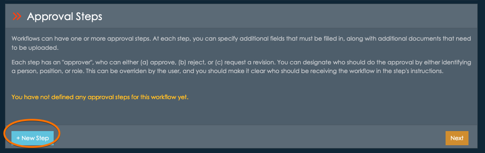

In the case of our running example, let's define a **three step** sequence of approval.  First, the instructor of the course approves, then the Dean, and then the Registrar.  

Start by clicking **+ New Step**.

### Approval Step 1 - the instructor
Every step has a **title** - the **Step Label**.  This will be visible in several places, so try to be descriptive.  In addition, we'll add a description/instruction - which will be visible **to the approver** when the workflow reaches them.  

You will also see a similar set of input field choices as you saw when defining *submission data*.  Don't be confused - this is not the same!  These define data fields (or documents) that you expect the **approver** to add to the workflow.  This data might be necessary for the *next approver*, for example.

In our running example, let's ask the instructor to indicate whether or not the student has attended at all.  Maybe this would be important information for financial aid purposes.

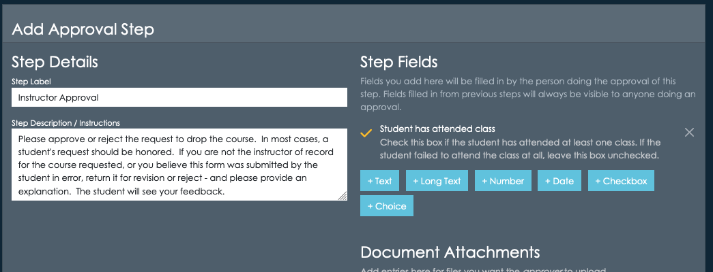

#### Selecting the Approver
Each approval step can be *open ended*, or a list of **pre-selected** approvers can be identified. 

- **No pre-selected approver** - the submitter can select **any** recipient for the approval, from the list of **People** in your institution.  This is the most flexible, but also puts a lot of responsibility on the submitter to determine who their workflow needs to go to first.  You'll want to be extremely clear in your submission instruction when using this option.
- **Pre-Selected by role** - Choose this options when the approval should go to people who hold a particular role at the institution - like "faculty", "Dean", or "Registrar".  This will often be the best choice for most institution-wide workflows.
- **Pre-Selected by position** - choose this option if the approval should be received by someone holding a specific position, which is a role **tied** to a particular department.  Check out (Roles, Positions &amp; Assignments)[./roles-positions-assignments.html] for help understanding the difference between a Position and a Role.  This is a good option when the form is specific to a certain department.
- **Pre-Selected by person** - choose this option when the approval step should be received by a specific individual.  This is the least flexible option, as you'll need to update the workflow if someone change's positions or leaves the institution.

For our example, we know that first approver should be an *instructor*.  We can specify this by using the **Pre-Selected by role** option, and adding pre-selections for both Faculty and Adjunct.  Depending on how you set up your roles, you may have different options.

Note, the submitter of this workflow will be able to choose anyone belonging to ANY of these roles.

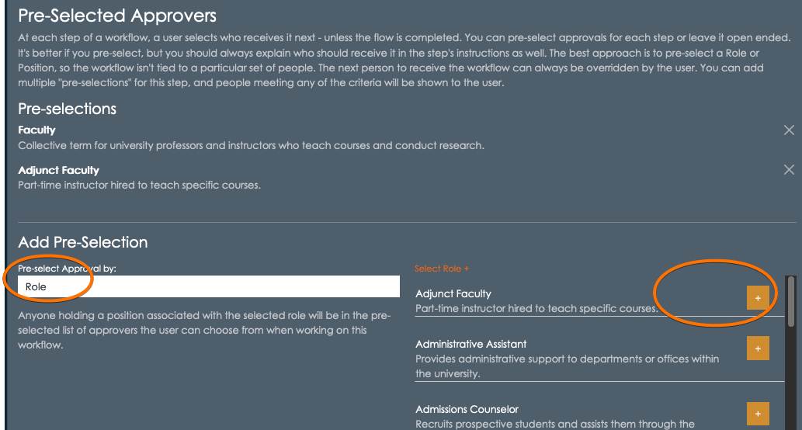

Click **+Save New Step** to continue.  

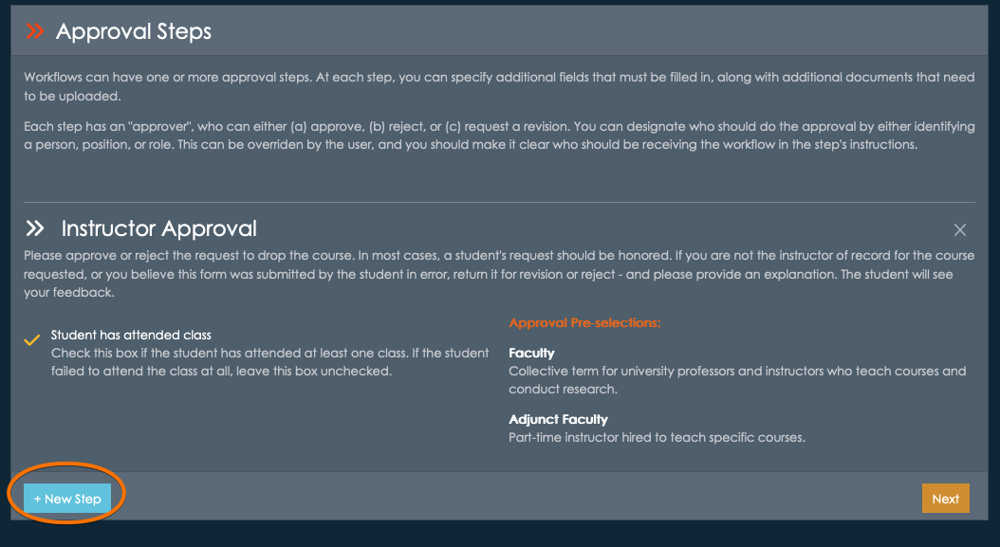

The approval step will be summarized in the display, and you can add a the next step by clicking **+ New Step**.

### Approval Step 2 - the Dean
For this approval step, you might not need anything else from the Dean - just an approval, rejection, or request for revision.  Approval fields and documents are optional, so you can just move right past this and onto the Pre-Selected Approvals.

In the example institution, there is a Dean role.  We'll select that and move on.

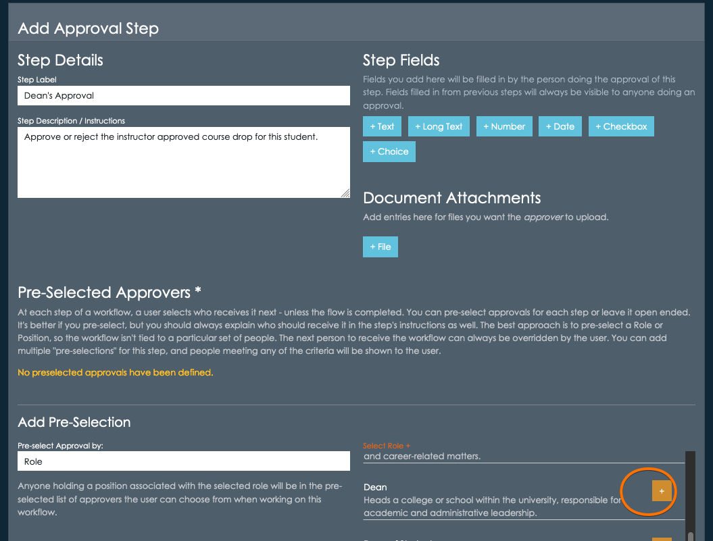

Click **+Save New Step** to continue.

### Processing Step (Approval Step 3) - the Registrar
The final step is the registrar's office, which is where the request will be processed.  Once again, this step doesn't require the Registrar to add any data, only approval/rejection/revision.

Click **+Save New Step** to continue.  Note that with all three steps entered, you can remove them by clicking the X button at the right, or re-order them using the arrows on the left.

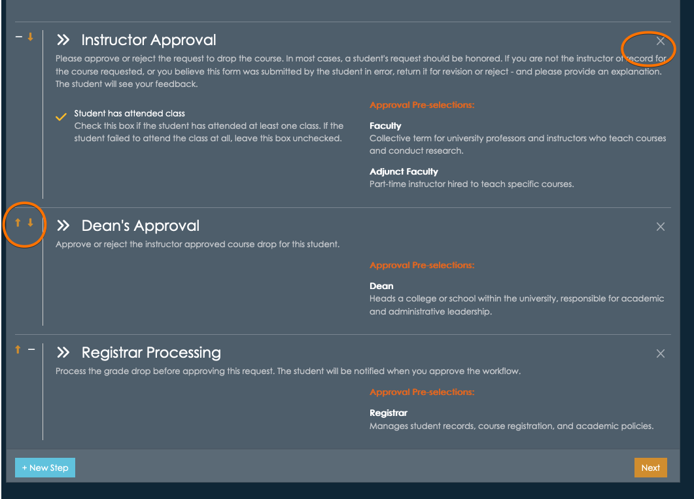

## Completing the Workflow
At this point, we've created the submission data and approval chain.  We are ready to complete, and since we've marked it as **active** it will be listed in the workflow listings.

Click **Next**.  

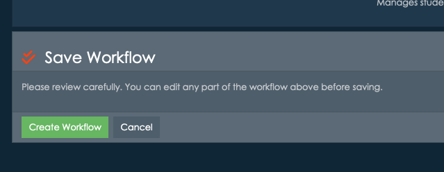

Review the workflow carefully, and click **Create Workflow**.  Now the workflow is complete and is available for use!